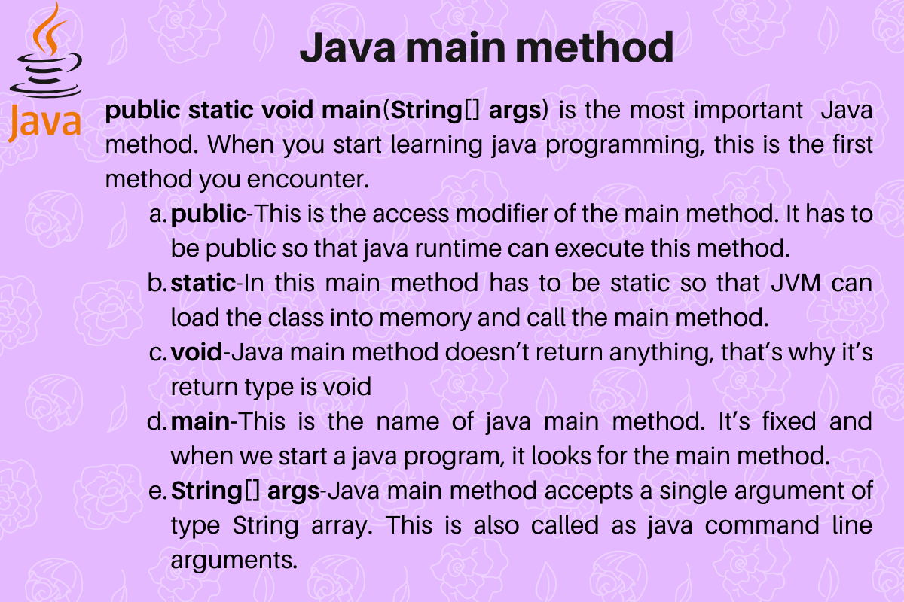
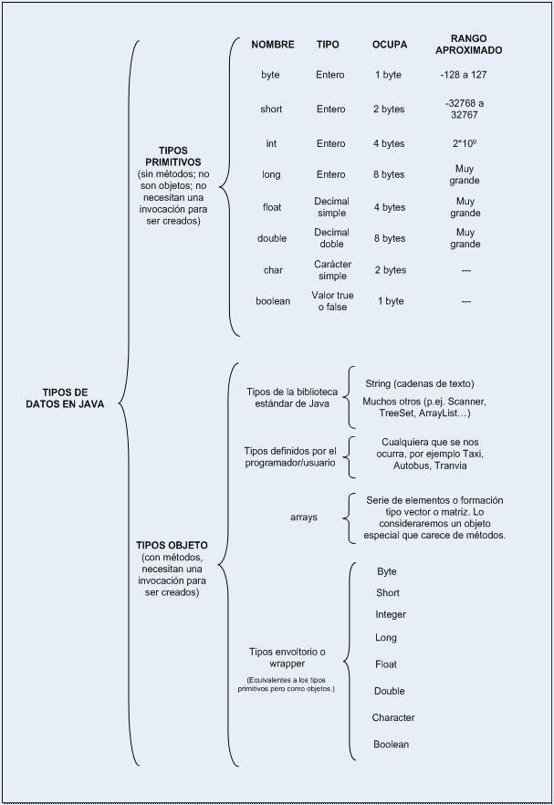
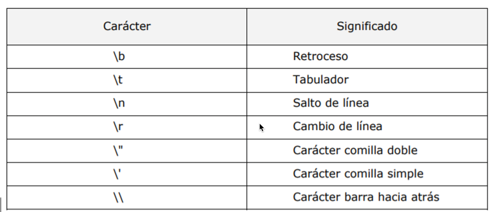
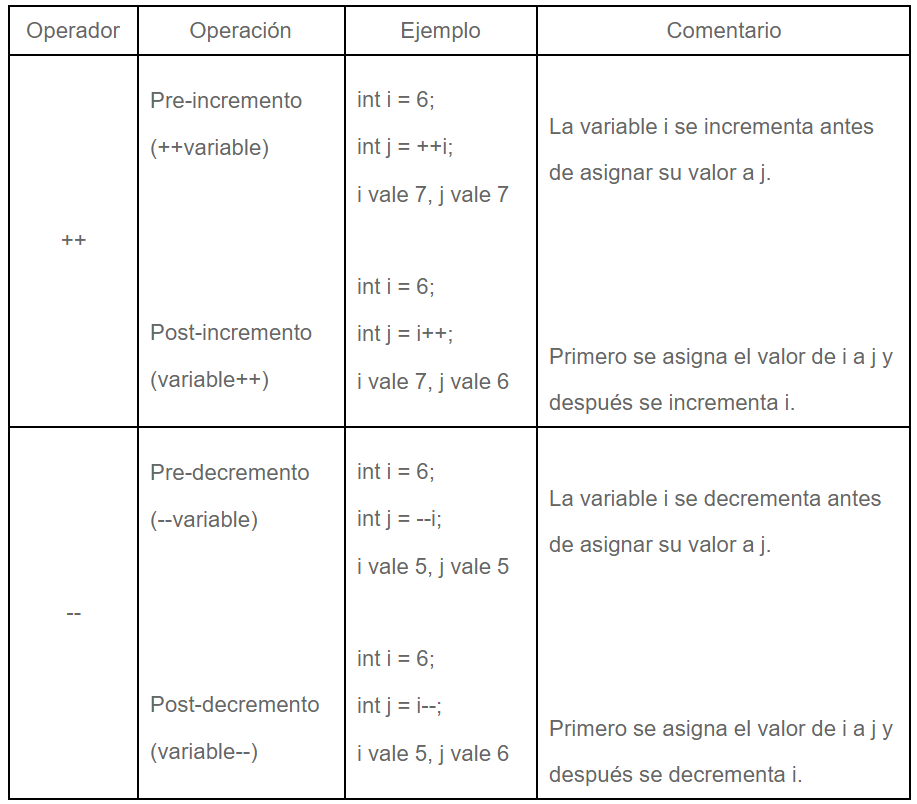
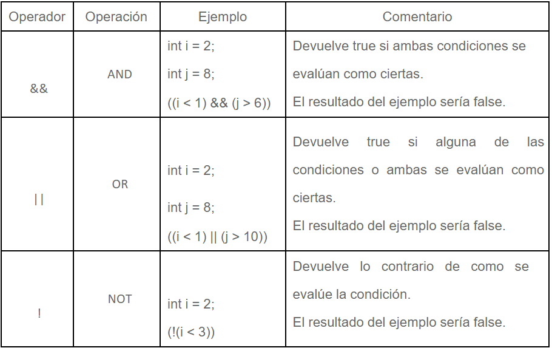
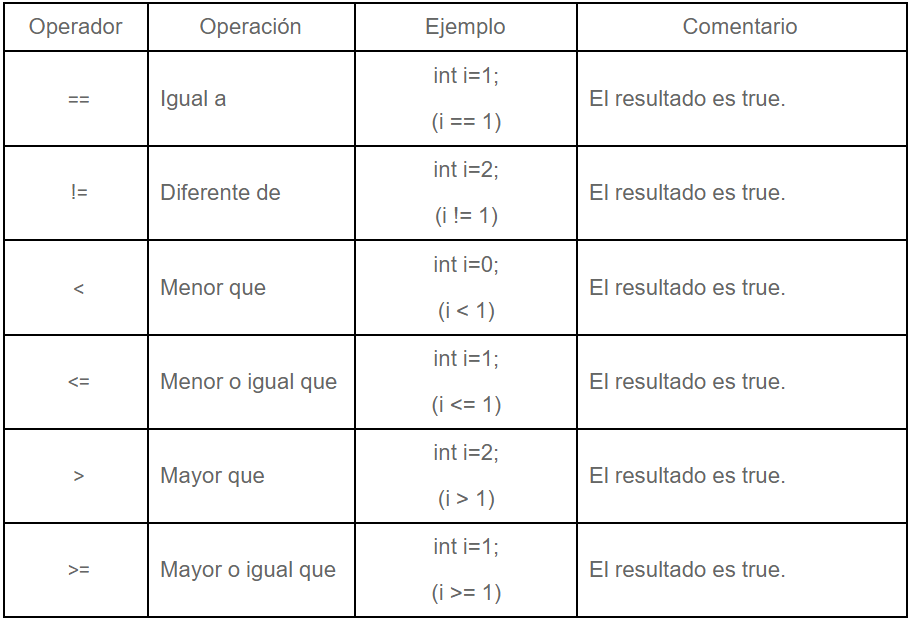
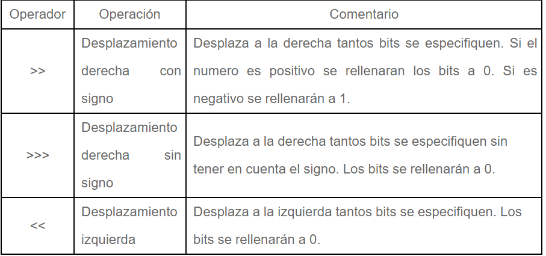

# Java


Resúmenes teóricos y ejercicios prácticos realizados por Ángel Garrido Álvarez durante el Máster en Diseño y Programación de Aplicaciones Java JEE - Universidad de Alcalá

## Indice

### Módulo 1 - TEMA 1 - Desarrollo de aplicaciones en JAVA

1.1.1. [ Introducción a la programación](#id111)

1.1.2. [IDE - Entorno de Desarrollo](#id112)

### Módulo 1 - TEMA 2 - Fundamentos de Programación en JAVA

1.2.1. [ Introducción a JAVA](#id121)

1.2.2. [ Programación con JAVA](#id122)

1.2.3. [ Estructuras de Control](#id123)

1.2.4. [ Arrays](#id124)


_________________________________________________________________________________


### Módulo 1 - TEMA 1 - Desarrollo de aplicaciones en JAVA

#### 1.1.1. Introducción a la programación <a name="id111"></a>

Existen muchos tipos de software: 
* instalados localmente
* En servidor 

Proyectos de software tienen ciclo de vida de desarrollo, pasos a seguir para desarrollar una aplicación que depende de metodología que utilicemos.

##### Concepto: programa informático
**Programa**:
* conjunto de órdenes que se ejecutan en el ordenador para conseguir un objetivo.
* capaces de hacer tres tipos de operaciones:
    * Aritméticas.
    * Lógicas (comparación de valores).
    * Almacenar la información.

**Algoritmo**: 
* Conjunto de procedimientos con los que al ser procesados, se consigue una acción. 
* Pueden estar compuestos a través de textos, números o símbolos. 
* La expresión de uno o más algoritmos es lo que se define como programa.

**Ensamblador**
* Lenguaje de programación a bajo nivel.
* Se comunica con el hardware sin intermediaros.
* Utiliza directamente las instrucciones del microprocesador para definir los algoritmos.

**Implementación**
* Codificación de un algoritmo en un lenguaje que se comunica con la computadora, produciendo la ejecución de un programa.
* Codificación:
    * Bajo nivel: lenguajes con comandos y funciones cercanas al modo en el que procesa los datos una computadora (código máquina, ensamblador)
    * Alto nivel: lenguajes con sintaxis más cercana a la forma en la que nos comunicamos los humanos.

###### Código fuente, código objeto y código ejecutable
**Código Fuente**: 
* conjunto de instrucciones escritas en un lenguaje de programación.
* no pueden ser directamente ejecutados por la computadora. 
* son posteriormente compilados o interpretados para su ejecución en los diferentes Sistemas Operativos. 
* Este proceso de traducción genera otro tipo de código que se define como el código objeto.
* Debe:
    * Ser fácil de leer y entendible por otros desarrolladores
    * Tener comentarios que expliquen su finalidad y componentes.
    * Realizar los procesos de la forma más simple posible.
    * Ser flexible a cambios para posteriores mantenimientos.
    * Funcional.

**Código Objeto**:
* Código máquina o binario que interpreta directamente la computadora. 
* Traducción del código fuente.
*  y crear el archivo ejecutable.
* El compilador:
    * Enlaza el código objeto del programa con otros programas.
    * Comprueba que el código no tenga errores
    * Crea el archivo ejecutable
    
**Código ejecutable** 
* Partiendo de los dos códigos anteriores, crea los archivos ejecutables para que nuestro sistema reconozca la aplicación. 
* Diferentes para cada SO


###### Clasificación de lenguajes de programación por técnica utilizada

**Secuencial**: va ejecutando las sentencias en orden una detrás de otra.

**Estructurada**: 
* Utiliza estructuras de control
* es una programación secuencial pues ejecuta una seguida de otra
* incorpora estructuras selectivas para la toma de decisiones y estructuras repetitivas.  
* La mayor parte de los lenguajes actuales derivan de este tipo de programación, adaptándose a otros paradigmas.

 

**Modular**: 
* consta de varios módulos  que interactúan entre sí. 
* Un módulo principal coordina las llamadas al resto de módulos y pasa los datos necesarios por parámetros.

 

**Programación orientada a objetos (POO)**:
* cada  conjunto de datos es un objeto con sus atributos y métodos.
* aumenta la velocidad del desarrollo de programas gracias a la reutilización de las partes del código.


Todas se puede subdividir en programación declarativa e imperativa:
* **Programación imperativa**: programación estructurada, modular y POO.
    * Se escriben sentencias que modifican el estado de un programa. 
    * Se indica paso a paso, cada uno de los pasos y la toma de decisiones que deben ocurrir en la ejecución.

**Programación declarativa**:
    * la solución se alcanza mediante procesos internos del lenguaje
    * sin especificar exactamente el proceso para llevarlo a cabo
    

##### Ingeniería de Software

* comprende todos los aspectos de la creación del software:
    * Definición, mantenimiento, etc.


* Software: Programas de ordenador y la documentación asociada. 

* Proceso del software: conjunto de actividades cuya meta es el desarrollo o evolución del software.

* Coste desarrollo software: 
    * 60 % desarrollo, 40 % pruebas
    * software personalizado: costos evolución > costos desarrollo.

 
* Métodos de desarrollo: Enfoques estructurados para el desarrollo de software que incluyen modelos de sistemas, notaciones, reglas, sugerencias de diseño y guías de procesos.


* CASE: Herramientas que intentan proporcionar ayuda automatizada a las actividades del proceso del software.

 
* Actividades del ciclo de vida de Software:  
    * Adquisición: preparación de la oferta para suministrar el software, seleccionaremos los agentes implicados en su realización.
    * Suministro: Contratos, identificación de los recursos necesarios para llevar a cabo el desarrollo.
    * Desarrollo: Actividades enfocadas a la creación del software: 
        * Análisis, diseño, codificación, pruebas, integración e implantación.
    * Explotación: Tiempo en el que la aplicación está en uso, en esta fase se da soporte operativo a los usuarios.
    * Mantenimiento: corrección errores, mejoras y adaptaciones a diferentes Hardware y SO.
 

* Procesos de soporte

    * Documentación: Registra la información de todas las tareas que se realizan en las diferentes fases y actividades del ciclo de vida.
    * Gestión de la Configuración: Actividades que controlan las modificaciones y cambios que se producen en las versiones de los elementos.
    * Aseguramiento de la calidad: Actividades para que el producto cumpla con los requisitos establecidos.
    * Verificación: Permiten determinar el correcto funcionamiento del producto.
    * Validación: Comprobar que el producto de software cumple con los requisitos establecidos, es decir cumple con los objetivos que se marcaron para su creación.
    * Revisión conjunta: Puesta en común de los diferentes grupos implicados en el proyecto para determinar y revisar las diferentes fases del ciclo de vida.
    * Auditorías: Actividades que se realizan en un determinado momento para comprobar que se están consiguiendo los objetivos propuestos: requisitos, cumplimento de los compromisos establecidos en el contrato, comprobar los plazos, etc.
    * Resolución de problemas: Resolución de problemas o disconformidades con los requisitos o con el contrato, que hayan surgido  durante la ejecución del proyecto.


* Procesos generales
    * Gestión: Planificación, seguimiento, revisiones…
    * Infraestructura: Recursos para la puesta en marcha del producto de software, tanto para su desarrollo como implantación y soporte futuro. Tanto en instalaciones, hardware, software, consumos, etc.
    * Mejora: Evaluar y mejorar cada uno de los procesos de vida del software.
    * Formación: Planes de formación para todos los agentes implicados en el proceso del ciclo de vida.

 

* Fases de desarrollo/Modelos del ciclo de viva de software

    * ayudan a organizar las diferentes etapas y actividades del ciclo de vida, diferenciando las etapas y actividades del ciclo de vida del software.

    * Modelo en cascada
         * Dividido en etapas que se realizan secuencialmente.
         * Una etapa no puede empezar hasta que no haya terminado la anterior. 
         * En cada fase generaremos toda la documentación necesaria para explicar lo realizado y las bases para el siguiente paso. 
         * Modelo dirigido por documentos.

         * Ventajas

            * Útil cuando se tienen claros los requisitos desde el principio.
            * Con equipos de trabajo pequeños o inexpertos, pues tiene una estructura de trabajo muy definida y se apoya en mucha documentación.
            * Cuando se realizan migraciones de software.

         * Inconvenientes
            * El tener que definir al inicio todos los requisitos no es realista, pues suelen aparecer nuevas necesidades a lo largo del desarrollo.
            * El cliente no ve el producto terminado hasta finalizar el proceso.
            * Es poco flexible a cambios.
 
    * Modelo iterativo
        * Modelo evolutivo que se basa en prototipos que se pueden probar. 
        * Ayuda a perfeccionar los requisitos del sistema.
        * Está compuesto por iteraciones.
        * en cada iteración se revisan y mejoran las diferentes partes del producto hasta llegar a la solución final.

        * Ventajas
            * Se pueden ir viendo los resultados durante el proceso.
            * Cuando el cliente no sabe lo que quiere y los requisitos no están bien definidos desde el principio .
            * Reduce el riesgo de no cumplir las necesidades de los usuarios.
            * Cuando los requisitos cambian durante el proceso.
            
        * Inconvenientes
            * El diseño del prototipo hace que los desarrolladores utilicen herramientas que faciliten la rápida generación de código, dejando a un lado la eficiencia, fiabilidad y otros  aspectos de calidad.
            * Probablemente no se tendrá un código óptimo.
            * Exige disponer de las herramientas específicas.

    * Modelo incremental
            * Es un modelo evolutivo que permite desarrollar versiones cada vez más completas del producto.
            * Parte de los elementos del  modelo en cascada, repitiendo los procesos con el objetivo de la construcción de prototipos.

        * Ventajas
            * Los clientes se involucran más en todo el proceso.
            * Se puede ir revisando el producto en toda la fase de desarrollo.
            * Fácil introducción de cambios.
            
        * Inconvenientes
            * Los incrementos deben de ser pequeños.
            * Se necesita un grado muy alto de planificación.
            * Difícil de documentar.


##### Herramientas CASE (Computer Aided Software Engineering)
* aplicaciones que nos ayudan a aumentar la productividad en el desarrollo del software.
* Objetivos:
    * Aumentar la calidad del producto.
    * Reducir el tiempo y los costes.
    * Mejorar la planificación en los procesos de desarrollo.
    * Aumentar la biblioteca de conocimiento.
    * Automatizar procesos en un desarrollo.
    * Ayuda a la reutilización del código.
    * Facilitar el uso de metodologías de desarrollo.
 

* Clasificación según la fase del ciclo de vida en las que las que intervienen:
    * I-CASE (Integrated CASE): abarcan todas las fases del ciclo de vida del desarrollo de sistemas.
        * Herramientas de alto nivel, U-CASE (Upper CASE - CASE superior) o front-end: 
            * orientadas a la automatización y soporte de las actividades desarrolladas durante las primeras fases del desarrollo: Definición, análisis y diseño.
        * Herramientas de bajo nivel, L-CASE (Lower CASE - CASE inferior) o back-end:, dirigidas a las últimas fases del desarrollo: Implementación, pruebas y mantenimiento.


#### 1.1.2. IDE - Entorno de Desarrollo <a name="id112"></a>

* Aplicación que nos ayuda en la tarea de creación de nuestros proyectos de software. 
* Es un editor de código, un compilador, un depurador y un constructor de interfaz gráfica (GUI).
 

* Editor de texto: Es la parte que nos permite escribir el código fuente del programa. 

* Una parte importante, es que no solo nos corregirá en caso de que detecte un error, sino que también nos mostrará sugerencias e indicaciones del posible fallo que estemos cometiendo.

* El Compilador: el código fuente tecleado por el programador (escrito en un lenguaje de alto nivel), necesita ser traducido a un programa escrito en lenguaje de bajo nivel (lenguaje máquina). El IDE realiza estas compilaciones de nuestro código para que podamos ir realizando pruebas de nuestro código mientras lo estamos desarrollando.

* El Intérprete: Los intérpretes se diferencian de los compiladores en que solo realizan la traducción a medida que se va ejecutando el código. En lenguajes interpretados como PHP o Javascript, el IDE va ejecutando el código línea a línea como si se tratara del entorno de producción (lo que se conoce como máquina virtual).

* Depurador (Debugger): El depurador es una herramienta que nos permite comprobar el funcionamiento de nuestro código, examina paso a paso, instrucción a instrucción, la ejecución de un programa y cambios que se produzcan en las variables del programa o en los registros del procesador. El depurador nos va a permitir detener el programa en un punto de ruptura para examinar los caminos o el valor de los datos que tienen en cada momento.

##### JDK
* Java Development Kit (JDK) es un software que provee herramientas de desarrollo para la creación de programas en Java. Puede instalarse en una computadora local o en una unidad de red.

* En la unidad de red se pueden tener las herramientas distribuidas en varias computadoras y trabajar como una sola aplicación.

_______________________________________________________________________________________________________________________________________________________________

### Módulo 1 - TEMA 2 - Fundamentos de Programación en JAVA

#### 1.2.1. Introducción a JAVA <a name="id121"></a>
Java es un conjunto de: 
    * un lenguaje
    * una plataforma de desarrollo (JDK - Java Development Kit)
    * un entorno de ejecución para los programas compilados (JRE - Java Runtime Environment)
        * Portabilidad: gratuito y disponible principales SO 
        * Los programas se compilan en un lenguaje intermedio, ByteCode que es interpretado por la máquina virtual (JVM) del entorno de ejecución (JRE) y así se obtiene la portabilidad. 
        * JRE intermediario entre el código ByteCode y los distintos sistemas operativos existentes.
    * un conjunto de librerías de desarrollo. (Java API - Java Application Programming Interface).

* Desarrollado por Sun Microsystems, 1995.
* Valorado por ser independiente del SO en el que trabaja.
    

 
##### Proceso de edición y compilación.
* Se sigue el proceso: 
    * edición del código fuente (con el IDE)
    * compilación (con Javac - Java Compilator o con el IDE - comprueba que el código fuente se compone de palabras válidas en Java y que los comandos Java tienen una sintaxis correcta.) 
    * y ejecución (compilación genera un fichero de tipo class en Bytcode para que JVM lo interprete y ejecute la aplicación)

* El código fuente se compila para obtener el Bytecode que será interpretado por la JVM

##### Codificación de programas Java.
 
Legibilidad: fácil de entender y de leer.

Corrección.- Un programa debe cumplir los requisitos funcionales y técnicos establecidos en la fase de especificación. Durante la fase de prueba se verificará.

Eficiencia.- tiempo que tarda el programa en ejecutarse, recursos que consume.


#### 1.2.2. Programación con JAVA <a name="id122"></a>


##### Estructura general de un programa en Java.
```java
/*

* Este programa muestra el texto “Hola Mundo, programo en Java” por la consola.

*/

public class HolaMundo{ //Definición de la clase

    public static void main (String[] args){ //método principal

    System.out.println("Hola Mundo, programo en Java"); //Sentencias

    }

}
```



[fuente](https://www.journaldev.com/)

* In Java, void keyword is used with the method declaration to specify that this particular method is not going to return any value after completing its execution.
* The only difference between println() and print() method is that println() throws the cursor to the next line after printing the desired result whereas print() method keeps the cursor on the same line.
##### Programa en Java: calcular área y perímetro de un cuadrado:

```java

public class areayperimetro{

    public static void main (String[] args){

        // Declaramos las variables para trabajar con ellas.
        double lado =5.0, area, perimetro; //double: tipo de dato decimal doble
        area = lado*lado;
        perimetro = lado+lado+lado+lado; // o bien 4*lado;
        
        System.out.println("El area es: ",area);

        System.out.println("El perímetro es: ",perimetro);
    }
}

/*
El area es: 25.0
El perímetro es: 20.0
*/
```

##### Saltos de línea y espacios:

* Los saltos de linea se hacen con \n 
```java
public class SoyAntonio {
    public static void main (String[] args){

        System.out.print("Hola");
        System.out.print(" ");
        System.out.print("soy Antonio");
        System.out.print("\nVS\n");//Meto dos saltos de línea
        System.out.print("Hola");
        System.out.print("soy Antonio");
    }
}

/*
Hola soy Antonio
VS
Holasoy Antonio
 */
```


##### Variables
**Requisitos de los Identificadores de las Variables**

* Un identificador debe de comenzar con una letra que puede ser seguida de más letras o dígitos. Una letra es cualquier símbolo del alfabeto y un dígito son cualquier carácter entre ‘0’ y ‘9’. 
* Un identificador no puede llamarse igual que las palabras reservadas que tienen los lenguajes de programación. Por ejemplo no podemos usar un identificador llamado for o while.
* Un identificador escrito en minúscula es totalmente distinto del mismo identificador en mayúscula, es decir, pvp y PVP serían dos variables totalmente distintas. Java diferencia entre las letras mayúsculas y minúsculas.
* Los identificadores correspondientes a una clase deberán de empezar siempre con la primera en mayúscula y si se trata de nombres compuestos no se usara el _ para separar y cada nombre su primer carácter en mayúscula, como por ejemplo HolaMundo, Persona, Profesor, Academia …
* Los identificadores para variables y métodos deberán de comenzar siempre con el primer carácter en minúscula y no se debe de usar un _ para separar en caso de compuestos, como por ejemplo: sueldo, calcularSueldo, getNombre …

En Java hay que decir el tipo de dato que tiene cada variable

```java
public class variables {
    public static void main(String[] args) {
        int dia = 28;
        int mes = 7;
        int ano = 2018;

        System.out.println("día " + dia + " del mes " + mes + " de " + ano);
    }
}
```
También se puede expresar de las siguientes formas:

```java
public class variables {
    public static void main(String[] args) {
        int dia;
        int mes;
        int ano;

        dia = 3;
        mes = 12;
        ano = 1979;
    }
}
```
```java
public class variables {
    public static void main(String[] args) {
        int dia, mes, ano;

        dia = 3;
        mes = 12;
        ano = 1979;
    }
}
```
##### Tipos de datos



[fuente](https://www.aprenderaprogramar.com/index.php?option=com_content&view=article&id=419:tipos-de-datos-java-tipos-primitivos-int-boolean-y-objeto-string-array-o-arreglo-variables-cu00621b&catid=68&Itemid=188)

Caracteres:

Fuente: Máster en Diseño y Programación de Aplicaciones Java JEE - Universidad de Alcalá

##### OPERADORES 

###### OPERADORES MATEMÁTICOS


###### OPERADORES INCREMENTO Y DECREMENTO


###### OPERADORES LÓGICOS 


###### OPERADORES RELACIONALES


###### OPERADORES CON DESPLAZAMIENTO



Fuente: Máster en Diseño y Programación de Aplicaciones Java JEE - Universidad de Alcalá


#### 1.2.3. Estructuras de Control <a name="id123"></a>

**Estructuras Selectivas / Condicionales**
* if
* if else
* if else if
* Switch (solo valores int o char)
* Ternario (no recomendado - poca legibilidad código)

**Estructuras Iterativas / Bucles**
* while
* do-while
* for


[Ejemplos](EclipseWorkSpace/1.2.FundamentosJava/src)


[**Ejercicio Feedback 1.2.**](EclipseWorkSpace/EjercicioFeedback1/src/ejercicio1/Ejercicio1.java)

Un centro de estudios nos ha solicitado que realicemos un algoritmo para saber la motivación que tienen los alumnos para estudiar programación.

Para ello quiere realizar una serie de preguntas y según la respuesta valorar su interés por estos estudios.

Cada respuesta tendrá un valor de 0 o 1 siendo el resultado el porcentaje total la suma de los valores obtenidos.

Si el valor obtenido en el primer intento es superior al 80% el ejercicio le dará la enhorabuena, si es inferior le pedirá volver a realizar el test con todas las preguntas dos veces mas. (El alumno solo podrá realizar la prueba tres veces).

Una vez realizado el test la tres veces, si la media de los resultados es inferior al 50%, se le pedirá que se lo comente a su profesor. Si es superior el programa terminara y le dará la enhorabuena.

Las preguntas para realizar son:

Te gustan las computadoras.  Si(1)  No(0)
Disfrutas con la resolución de problemas. Si(1) No(0)
Quieres trabajar en equipo. Si(1) No(0)
Te agrada aprender por descubrimiento o prefieres que te indiquen las cosas paso a paso. Si(1) No(0)
Eres creativo. Si(1) No(0)
Eres resolutivo. Si(1) No(0)
Te rindes al primer intento Si(0) No(0)
Estas dispuesto a tener que actualizar tu conocimiento a lo largo de tu vida Si(1) No(0)

___________________________________
* Programa principal java se compone de sentencias.

* Flujo de un programa: orden de ejecución de las sentencias

* Estructuras de control permiten modificar el flujo normal de un programa.
    * Selectivas.
    * Iterativas o repetitivas.
    
    
___________________________________
## 1.2.4. Arrays <a name="id124"></a>

* Se debe definir tamaño al inicio (elementos máximos)
* Todos los elementos del mismo tipo
* Una vez fijado el tamaño no se puede redimensionar

Tipos de array

```java
//Array con tipos primitivos

int numeros[]

//Array de objetos

Alumno alumnos[]
```

#### Formas de declarar arrays:
```java
//Declaramos como variables tipo array num1 y num2, en este caso da = la colacación delos corchetes
int num1[];
 
int [] num2;
 
//En estos casos influye la colocación de los corchetes
int n1[], n2; //aquí n1 es un array pero n2 es un int
 
int[] n3,n4; //aquí n3 y n4 son arrays
```

#### Formas de crear arrays:
```java
numeros = new int[5]; //array numeros puede contener 5 int

alumnos = new Alumno[3];// array Alumnos puede contener 5 objetos alumno
```
Intro: [Arrays.java](EclipseWorkSpace\1.2.FundamentosJava\src\arrays\Arrays.java)
```java
package arrays;

public class Arrays {

	public static void main(String[] args) {
		
		
		//Creamos el array, es obligatorio dar un taño
		numeros = new int[5];
		
		
		//Almacenamos elementos en el array:
		
		numeros[0]= 10;
		numeros[1]= 20;
		numeros[2]= 30;
		numeros[3]= 40;
		numeros[4]= 50;
		
		
		System.out.println(numeros[0]); //10
		
		//Bucle For
		
		for(int i=0; i<numeros.length; i++) {
			System.out.print(numeros[i] + " ");//10 20 30 40 50 
		}
		
        System.out.print("\n");//Meto un salto de línea

		//Bucle For-each
		
		//En el bucle for each no se precisa indicar el indice de los elementos:
		
		int numeros2[] = {1,2,3,4,5,6};
		int numeros3[] = new int[] {7,8,9,10};
		
		for(int num : numeros2) {
			System.out.print(num + ", "); //1, 2, 3, 4, 5, 6, 

		};
        
		System.out.print("\n:-)\n");//Meto dos saltos de línea y una carita
		
		for(int numerito : numeros3) {
			System.out.print(numerito + " ~ "); 
		}

        //Salida por pantalla
        /*
        10
        10 20 30 40 50 
        1, 2, 3, 4, 5, 6, 
        :-)
        7 ~ 8 ~ 9 ~ 10 ~ 
        */

	}
}
```

#### COPIAR ELEMENTOS DE UN ARRAY EN OTRO:

* System.arraycopy(array origen, posición inicio array origen, array destino, posición inicio array destino, nªde elementos a copiar)

**Ejemplo1:**

* Copiamos 3 elementos del array nums comenzando en el índice 2 y los pegamos en el array números a partir de la posición con índice 1.
```java
System.arraycopy(nums, 2, numeros, 1, 3)
```

**Ejemplo2:**

```java
		int numeritos1[] = { 1, 1, 1, 1, 1, 1 };
		int numeritos123[] = { 1, 2, 3, 4, 5, 6, 7, 8, 9, 10 };

		System.arraycopy(numeritos1, 0, numeritos123, 0, 6);

		// hacemos un for each para que me imprima todo por pantalla:

		for (int elemento : numeritos123) {
			System.out.print(elemento + ", "); //1, 1, 1, 1, 1, 1, 7, 8, 9, 10, 
        }
```java

```
#### MATRICES: ARRAYS DE VARIAS DIMENSIONES: [Matrix.java](EclipseWorkSpace\1.2.FundamentosJava\src\arrays\Matrixays.java)

* Para declarar matrices utilizamos tantos grupos de corchetes como dimensiones queremos en el array.


    ```java
    // Declarar una variable de tipo array de dos dimensiones

    int [][] numeros;
    ```

#### <u>Crear Matrices cuadradas:</u>

* = Nº de columnas para todas las filas

* En el siguiente ejemplo creamos la matriz números con 3 filas y 2 columnas y también creamos la matriz alumnos con 2 filas y 2 columnas.

```java
numeros = new int[3][2];
alumnos = new alumno[2][2];
```

#### <u>Crear Matrices no cuadradas:</u>

* != Nº de columnas para todas las filas

* En el siguiente ejemplo creamos una matriz no cuadrada con 2 filas, la primera de ellas contendrá 3 columnas y la segunda contendrá 2 columnas.

```java
int [][] nums = new int[2][];

nums[0] = new int[3];
nums[1] = new int[2];
```

#### <u>Almacenar elementos en una matriz</u>

* Para almacenar elementos necesitamos acceder a sus índices fila y columna.

```java
// Almacenar elementos en una matriz

numeros[0][0] = 1;
numeros[0][1] = 2;
numeros[1][0] = 3;
numeros[1][1] = 4;
numeros[2][0] = 5;
numeros[2][1] = 6;
```

#### <u>Declarar, crear y almacenar elementos</u>

* Podemos unificar todas estas tareas en una sola instrucción:
    * ejemplo1 creamos una matriz cuadrada de 2 filas y 2 columnas
    * ejemplo2 creamos una matriz no cuadrada de 3 filas de 3, 4 y 2 columnas respectivamente

```java
int numeros1[][] = {{5,1}, {9,2}};
int numeros2[][] = {{5,1,3}, {9,2,8,5},  {3,7}};
```

#### <u>Acceder a un elemento</u>

* Accedemos al elemento 2 de la fila 1
```java
System.out.println(numeros[0][2])
```

#### <u>Recorrer una matriz</u>


**BUCLE FOR**

Necesitamos de dos bucles anidados. El primero de ellos es el encargado de recorrer el array de las filas con el índice i mientras que el segundo es quien recorre el array de las columnas. Este código es válido para recorrer matrices cuadradas y no cuadradas.

```java
// Crear el array especificamos las filas y columnas

numeros = new int[3][2];


// Llenar de elementos el array

numeros[0][0] = 6;
numeros[0][1] = 2;
numeros[1][0] = 4;
numeros[1][1] = 3;
numeros[2][0] = 9;
numeros[2][1] = 8;

// Recorrer un array
for(int fila=0; fila<numeros.length; fila++){
    for(int col = 0; col<numeros[fila].length; col++){
        System.out.print(numeros[fila][col] + " ");
    }
System.out.println();
}
```

**BUCLE FOR-EACH**

Con el bucle for-each nuevamente necesitamos de dos bucles anidados. El primero nos devuelve los arrays de las columnas que recorremos en el bucle interno. El resultado que obtenemos es el que vemos a continuación.

```java
int numeros2[][] = {{5,1,3},
{9,2},
{3,7,3,6,9,1}};


for(int[] columnas : numeros2){
   for(int num : columnas){
      System.out.print(num + " ");
  }
System.out.println();

}
```

[EJERCICIOS CON SOLUCIONES](Ejercicios\1.2.4.Arrays)

