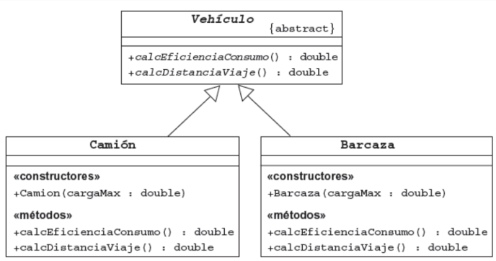
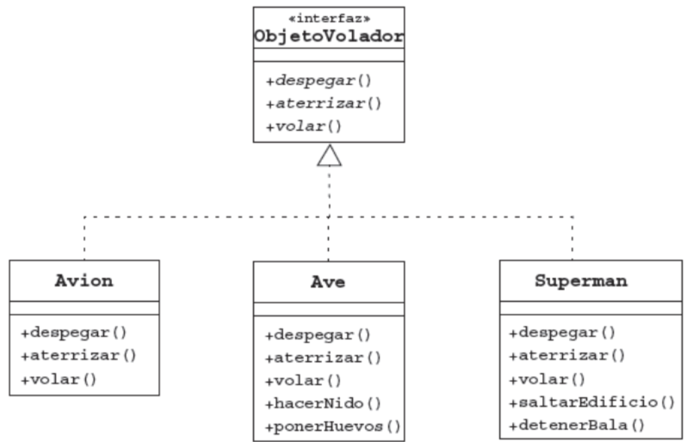
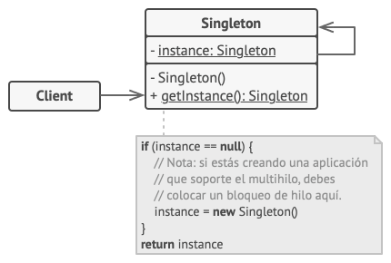

Resúmenes teóricos y ejercicios prácticos realizados por Ángel Garrido Álvarez durante el Máster en Diseño y Programación de Aplicaciones Java JEE - Universidad de Alcalá - Grupo Atrium. Profesores: Antonio Otero y Antonio Cardador

# Módulo 1

## 1 - Desarrollo de aplicaciones en JAVA

1.1. [ Introducción a la programación](#id111)

1.2. [IDE - Entorno de Desarrollo](#id112)

## 2 - Fundamentos de Programación en JAVA

2.1. [ Introducción a JAVA](#id121)

2.2. [ Programación con JAVA](#id122)

2.3. [ Estructuras de Control](#id123)

2.4. [ Arrays](#id124)


## 3 - POO - Programación Orientada a Objetos

3.1. [ POO - Programación Orientada a Objetos](#id131)

3.2. [ Clases Avanzadas](#id132)

3.3. [ Excepciones y Aserciones](#id133)

3.4. [ Colecciones](#id134)

## 4 - Mecanismos de Entrada / Salida

4.1. [Gestión de E/S por terminal y ficheros](#id141)

## 5 - Diseño de interfaces

5.1 [Diseño de interfaces gráficas con Swing](#id151)

## 6 - Bases de Datos
6.1 [Manipulación de datos con JDBC](#id61)

## 7 [Modelo Vista Controlador](#id7)


## EJERCICIOS
* [EJERCICIOS ARRAYS](Ejercicios/1.2.4.Arrays)
* [EJERCICIOS POO](Ejercicios/1.3.1.POO)
* [EJERCICIOS HERENCIAS](Ejercicios/1.3.2.ClasesAvanzadas/Herencia)
* [EJERCICIOS Static y Final](Ejercicios/1.3.2.ClasesAvanzadas/StaticYFinal)
* [EJERCICIOS Clases Abstractas](Ejercicios/1.3.2.ClasesAvanzadas/ClasesAbstractas)
* [EJERCICIOS Interfaces](Ejercicios/1.3.2.ClasesAvanzadas/Interfaces)
* [EJERCICIOS ClasesEnvolventes](Ejercicios/1.3.2.ClasesAvanzadas/ClasesEnvolventes)
* [EJERCICIOS Excepciones y Aserciones](Ejercicios/1.3.3.ExcepcopnesAserciones)
* [EJERCICIOS COLECCIONES](Ejercicios/1.3.4Colecciones)


## EJERCICIOS FEEDBACK
* [**Ejercicio Feedback 1.2. - Estructuras de Control**](#id12e)
* [**Ejercicio Feedback 1.2.4 - Bucles**](#id124e)
* [**Ejercicio Feedback 1.3.1 - POO**](#id131e)
* [**Ejercicio Feedback 1.3.2 - POO - Clases Avanzadas**](#id132e)
* [**Ejercicio Feedback 1.3.4 - Colecciones**](#id134e)


_________________________________________________________________________________


# TEMA 1 - Desarrollo de aplicaciones en JAVA

## 1.1. Introducción a la programación <a name="id111"></a>

Existen muchos tipos de software: 
* instalados localmente
* En servidor 

Proyectos de software tienen ciclo de vida de desarrollo, pasos a seguir para desarrollar una aplicación que depende de metodología que utilicemos.

### Concepto: programa informático
**Programa**:
* conjunto de órdenes que se ejecutan en el ordenador para conseguir un objetivo.
* capaces de hacer tres tipos de operaciones:
    * Aritméticas.
    * Lógicas (comparación de valores).
    * Almacenar la información.

**Algoritmo**: 
* Conjunto de procedimientos con los que al ser procesados, se consigue una acción. 
* Pueden estar compuestos a través de textos, números o símbolos. 
* La expresión de uno o más algoritmos es lo que se define como programa.

**Ensamblador**
* Lenguaje de programación a bajo nivel.
* Se comunica con el hardware sin intermediaros.
* Utiliza directamente las instrucciones del microprocesador para definir los algoritmos.

**Implementación**
* Codificación de un algoritmo en un lenguaje que se comunica con la computadora, produciendo la ejecución de un programa.
* Codificación:
    * Bajo nivel: lenguajes con comandos y funciones cercanas al modo en el que procesa los datos una computadora (código máquina, ensamblador)
    * Alto nivel: lenguajes con sintaxis más cercana a la forma en la que nos comunicamos los humanos.

### Código fuente, código objeto y código ejecutable
**Código Fuente**: 
* conjunto de instrucciones escritas en un lenguaje de programación.
* no pueden ser directamente ejecutados por la computadora. 
* son posteriormente compilados o interpretados para su ejecución en los diferentes Sistemas Operativos. 
* Este proceso de traducción genera otro tipo de código que se define como el código objeto.
* Debe:
    * Ser fácil de leer y entendible por otros desarrolladores
    * Tener comentarios que expliquen su finalidad y componentes.
    * Realizar los procesos de la forma más simple posible.
    * Ser flexible a cambios para posteriores mantenimientos.
    * Funcional.

**Código Objeto**:
* Código máquina o binario que interpreta directamente la computadora. 
* Traducción del código fuente.
*  y crear el archivo ejecutable.
* El compilador:
    * Enlaza el código objeto del programa con otros programas.
    * Comprueba que el código no tenga errores
    * Crea el archivo ejecutable
    
**Código ejecutable** 
* Partiendo de los dos códigos anteriores, crea los archivos ejecutables para que nuestro sistema reconozca la aplicación. 
* Diferentes para cada SO


### Clasificación de lenguajes de programación por técnica utilizada

**Secuencial**: va ejecutando las sentencias en orden una detrás de otra.

**Estructurada**: 
* Utiliza estructuras de control
* es una programación secuencial pues ejecuta una seguida de otra
* incorpora estructuras selectivas para la toma de decisiones y estructuras repetitivas.  
* La mayor parte de los lenguajes actuales derivan de este tipo de programación, adaptándose a otros paradigmas.

 

**Modular**: 
* consta de varios módulos  que interactúan entre sí. 
* Un módulo principal coordina las llamadas al resto de módulos y pasa los datos necesarios por parámetros.

 

**Programación orientada a objetos (POO)**:
* cada  conjunto de datos es un objeto con sus atributos y métodos.
* aumenta la velocidad del desarrollo de programas gracias a la reutilización de las partes del código.


Todas se puede subdividir en programación declarativa e imperativa:
* **Programación imperativa**: programación estructurada, modular y POO.
    * Se escriben sentencias que modifican el estado de un programa. 
    * Se indica paso a paso, cada uno de los pasos y la toma de decisiones que deben ocurrir en la ejecución.

**Programación declarativa**:
    * la solución se alcanza mediante procesos internos del lenguaje
    * sin especificar exactamente el proceso para llevarlo a cabo
    

### Ingeniería de Software

* comprende todos los aspectos de la creación del software:
    * Definición, mantenimiento, etc.


* Software: Programas de ordenador y la documentación asociada. 

* Proceso del software: conjunto de actividades cuya meta es el desarrollo o evolución del software.

* Coste desarrollo software: 
    * 60 % desarrollo, 40 % pruebas
    * software personalizado: costos evolución > costos desarrollo.

 
* Métodos de desarrollo: Enfoques estructurados para el desarrollo de software que incluyen modelos de sistemas, notaciones, reglas, sugerencias de diseño y guías de procesos.


* CASE: Herramientas que intentan proporcionar ayuda automatizada a las actividades del proceso del software.

 
* Actividades del ciclo de vida de Software:  
    * Adquisición: preparación de la oferta para suministrar el software, seleccionaremos los agentes implicados en su realización.
    * Suministro: Contratos, identificación de los recursos necesarios para llevar a cabo el desarrollo.
    * Desarrollo: Actividades enfocadas a la creación del software: 
        * Análisis, diseño, codificación, pruebas, integración e implantación.
    * Explotación: Tiempo en el que la aplicación está en uso, en esta fase se da soporte operativo a los usuarios.
    * Mantenimiento: corrección errores, mejoras y adaptaciones a diferentes Hardware y SO.
 

* Procesos de soporte

    * Documentación: Registra la información de todas las tareas que se realizan en las diferentes fases y actividades del ciclo de vida.
    * Gestión de la Configuración: Actividades que controlan las modificaciones y cambios que se producen en las versiones de los elementos.
    * Aseguramiento de la calidad: Actividades para que el producto cumpla con los requisitos establecidos.
    * Verificación: Permiten determinar el correcto funcionamiento del producto.
    * Validación: Comprobar que el producto de software cumple con los requisitos establecidos, es decir cumple con los objetivos que se marcaron para su creación.
    * Revisión conjunta: Puesta en común de los diferentes grupos implicados en el proyecto para determinar y revisar las diferentes fases del ciclo de vida.
    * Auditorías: Actividades que se realizan en un determinado momento para comprobar que se están consiguiendo los objetivos propuestos: requisitos, cumplimento de los compromisos establecidos en el contrato, comprobar los plazos, etc.
    * Resolución de problemas: Resolución de problemas o disconformidades con los requisitos o con el contrato, que hayan surgido  durante la ejecución del proyecto.


* Procesos generales
    * Gestión: Planificación, seguimiento, revisiones…
    * Infraestructura: Recursos para la puesta en marcha del producto de software, tanto para su desarrollo como implantación y soporte futuro. Tanto en instalaciones, hardware, software, consumos, etc.
    * Mejora: Evaluar y mejorar cada uno de los procesos de vida del software.
    * Formación: Planes de formación para todos los agentes implicados en el proceso del ciclo de vida.

 

* Fases de desarrollo/Modelos del ciclo de viva de software

    * ayudan a organizar las diferentes etapas y actividades del ciclo de vida, diferenciando las etapas y actividades del ciclo de vida del software.

    * Modelo en cascada
         * Dividido en etapas que se realizan secuencialmente.
         * Una etapa no puede empezar hasta que no haya terminado la anterior. 
         * En cada fase generaremos toda la documentación necesaria para explicar lo realizado y las bases para el siguiente paso. 
         * Modelo dirigido por documentos.

         * Ventajas

            * Útil cuando se tienen claros los requisitos desde el principio.
            * Con equipos de trabajo pequeños o inexpertos, pues tiene una estructura de trabajo muy definida y se apoya en mucha documentación.
            * Cuando se realizan migraciones de software.

         * Inconvenientes
            * El tener que definir al inicio todos los requisitos no es realista, pues suelen aparecer nuevas necesidades a lo largo del desarrollo.
            * El cliente no ve el producto terminado hasta finalizar el proceso.
            * Es poco flexible a cambios.
 
    * Modelo iterativo
        * Modelo evolutivo que se basa en prototipos que se pueden probar. 
        * Ayuda a perfeccionar los requisitos del sistema.
        * Está compuesto por iteraciones.
        * en cada iteración se revisan y mejoran las diferentes partes del producto hasta llegar a la solución final.

        * Ventajas
            * Se pueden ir viendo los resultados durante el proceso.
            * Cuando el cliente no sabe lo que quiere y los requisitos no están bien definidos desde el principio .
            * Reduce el riesgo de no cumplir las necesidades de los usuarios.
            * Cuando los requisitos cambian durante el proceso.
            
        * Inconvenientes
            * El diseño del prototipo hace que los desarrolladores utilicen herramientas que faciliten la rápida generación de código, dejando a un lado la eficiencia, fiabilidad y otros  aspectos de calidad.
            * Probablemente no se tendrá un código óptimo.
            * Exige disponer de las herramientas específicas.

    * Modelo incremental
            * Es un modelo evolutivo que permite desarrollar versiones cada vez más completas del producto.
            * Parte de los elementos del  modelo en cascada, repitiendo los procesos con el objetivo de la construcción de prototipos.

        * Ventajas
            * Los clientes se involucran más en todo el proceso.
            * Se puede ir revisando el producto en toda la fase de desarrollo.
            * Fácil introducción de cambios.
            
        * Inconvenientes
            * Los incrementos deben de ser pequeños.
            * Se necesita un grado muy alto de planificación.
            * Difícil de documentar.


### Herramientas CASE (Computer Aided Software Engineering)
* aplicaciones que nos ayudan a aumentar la productividad en el desarrollo del software.
* Objetivos:
    * Aumentar la calidad del producto.
    * Reducir el tiempo y los costes.
    * Mejorar la planificación en los procesos de desarrollo.
    * Aumentar la biblioteca de conocimiento.
    * Automatizar procesos en un desarrollo.
    * Ayuda a la reutilización del código.
    * Facilitar el uso de metodologías de desarrollo.
 

* Clasificación según la fase del ciclo de vida en las que las que intervienen:
    * I-CASE (Integrated CASE): abarcan todas las fases del ciclo de vida del desarrollo de sistemas.
        * Herramientas de alto nivel, U-CASE (Upper CASE - CASE superior) o front-end: 
            * orientadas a la automatización y soporte de las actividades desarrolladas durante las primeras fases del desarrollo: Definición, análisis y diseño.
        * Herramientas de bajo nivel, L-CASE (Lower CASE - CASE inferior) o back-end:, dirigidas a las últimas fases del desarrollo: Implementación, pruebas y mantenimiento.


## 1.2. IDE - Entorno de Desarrollo <a name="id112"></a>

* Aplicación que nos ayuda en la tarea de creación de nuestros proyectos de software. 
* Es un editor de código, un compilador, un depurador y un constructor de interfaz gráfica (GUI).
 

* Editor de texto: Es la parte que nos permite escribir el código fuente del programa. 

* Una parte importante, es que no solo nos corregirá en caso de que detecte un error, sino que también nos mostrará sugerencias e indicaciones del posible fallo que estemos cometiendo.

* El Compilador: el código fuente tecleado por el programador (escrito en un lenguaje de alto nivel), necesita ser traducido a un programa escrito en lenguaje de bajo nivel (lenguaje máquina). El IDE realiza estas compilaciones de nuestro código para que podamos ir realizando pruebas de nuestro código mientras lo estamos desarrollando.

* El Intérprete: Los intérpretes se diferencian de los compiladores en que solo realizan la traducción a medida que se va ejecutando el código. En lenguajes interpretados como PHP o Javascript, el IDE va ejecutando el código línea a línea como si se tratara del entorno de producción (lo que se conoce como máquina virtual).

* Depurador (Debugger): El depurador es una herramienta que nos permite comprobar el funcionamiento de nuestro código, examina paso a paso, instrucción a instrucción, la ejecución de un programa y cambios que se produzcan en las variables del programa o en los registros del procesador. El depurador nos va a permitir detener el programa en un punto de ruptura para examinar los caminos o el valor de los datos que tienen en cada momento.

##### JDK
* Java Development Kit (JDK) es un software que provee herramientas de desarrollo para la creación de programas en Java. Puede instalarse en una computadora local o en una unidad de red.

* En la unidad de red se pueden tener las herramientas distribuidas en varias computadoras y trabajar como una sola aplicación.

_______________________________________________________________________________________________________________________________________________________________

# TEMA 2 - Fundamentos de Programación en JAVA

## 2.1. Introducción a JAVA <a name="id121"></a>
Java es un conjunto de: 
* un lenguaje
* una plataforma de desarrollo (JDK - Java Development Kit)
* un entorno de ejecución para los programas compilados (JRE - Java Runtime Environment)
    * Portabilidad: gratuito y disponible principales SO 
    
    * Los programas se compilan en un lenguaje intermedio, ByteCode que es interpretado por la máquina virtual (JVM) del entorno de ejecución (JRE) y así se obtiene la portabilidad. 
    
    * JRE intermediario entre el código ByteCode y los distintos sistemas operativos existentes.
    
    * un conjunto de librerías de desarrollo. (Java API - Java Application Programming Interface).

* Desarrollado por Sun Microsystems, 1995.
* Valorado por ser independiente del SO en el que trabaja.
    

 
### Proceso de edición y compilación.
* Se sigue el proceso: 
    * edición del código fuente (con el IDE)
    * compilación (con Javac - Java Compilator o con el IDE - comprueba que el código fuente se compone de palabras válidas en Java y que los comandos Java tienen una sintaxis correcta.) 
    * y ejecución (compilación genera un fichero de tipo class en Bytcode para que JVM lo interprete y ejecute la aplicación)

* El código fuente se compila para obtener el Bytecode que será interpretado por la JVM

### Codificación de programas Java.
 
* Legibilidad: fácil de entender y de leer.

* Corrección.- Un programa debe cumplir los requisitos funcionales y técnicos establecidos en la fase de especificación. Durante la fase de prueba se verificará.

* Eficiencia.- tiempo que tarda el programa en ejecutarse, recursos que consume.


## 2.2. Programación con JAVA <a name="id122"></a>


### Estructura general de un programa en Java.
```java
/*

* Este programa muestra el texto “Hola Mundo, programo en Java” por la consola.

*/

public class HolaMundo{ //Definición de la clase

    public static void main (String[] args){ //método principal

    System.out.println("Hola Mundo, programo en Java"); //Sentencias

    }

}
```


[fuente](https://www.journaldev.com/)

* In Java, void keyword is used with the method declaration to specify that this particular method is not going to return any value after completing its execution.
* The only difference between println() and print() method is that println() throws the cursor to the next line after printing the desired result whereas print() method keeps the cursor on the same line.
##### Programa en Java: calcular área y perímetro de un cuadrado:

```java

public class areayperimetro{

    public static void main (String[] args){

        // Declaramos las variables para trabajar con ellas.
        double lado =5.0, area, perimetro; //double: tipo de dato decimal doble
        area = lado*lado;
        perimetro = lado+lado+lado+lado; // o bien 4*lado;
        
        System.out.println("El area es: ",area);

        System.out.println("El perímetro es: ",perimetro);
    }
}

/*
El area es: 25.0
El perímetro es: 20.0
*/
```

### Saltos de línea y espacios:

* Los saltos de linea se hacen con \n 
```java
public class SoyAntonio {
    public static void main (String[] args){

        System.out.print("Hola");
        System.out.print(" ");
        System.out.print("soy Antonio");
        System.out.print("\nVS\n");//Meto dos saltos de línea
        System.out.print("Hola");
        System.out.print("soy Antonio");
    }
}

/*
Hola soy Antonio
VS
Holasoy Antonio
 */
```


### Variables
**Requisitos de los Identificadores de las Variables**

* Un identificador debe de comenzar con una letra que puede ser seguida de más letras o dígitos. Una letra es cualquier símbolo del alfabeto y un dígito son cualquier carácter entre ‘0’ y ‘9’. 
* Un identificador no puede llamarse igual que las palabras reservadas que tienen los lenguajes de programación. Por ejemplo no podemos usar un identificador llamado for o while.
* Un identificador escrito en minúscula es totalmente distinto del mismo identificador en mayúscula, es decir, pvp y PVP serían dos variables totalmente distintas. Java diferencia entre las letras mayúsculas y minúsculas.
* Los identificadores correspondientes a una clase deberán de empezar siempre con la primera en mayúscula y si se trata de nombres compuestos no se usara el _ para separar y cada nombre su primer carácter en mayúscula, como por ejemplo HolaMundo, Persona, Profesor, Academia …
* Los identificadores para variables y métodos deberán de comenzar siempre con el primer carácter en minúscula y no se debe de usar un _ para separar en caso de compuestos, como por ejemplo: sueldo, calcularSueldo, getNombre …

En Java hay que decir el tipo de dato que tiene cada variable

```java
public class variables {
    public static void main(String[] args) {
        int dia = 28;
        int mes = 7;
        int ano = 2018;

        System.out.println("día " + dia + " del mes " + mes + " de " + ano);
    }
}
```
También se puede expresar de las siguientes formas:

```java
public class variables {
    public static void main(String[] args) {
        int dia;
        int mes;
        int ano;

        dia = 3;
        mes = 12;
        ano = 1979;
    }
}
```
```java
public class variables {
    public static void main(String[] args) {
        int dia, mes, ano;

        dia = 3;
        mes = 12;
        ano = 1979;
    }
}
```
### Tipos de datos


[fuente](https://www.aprenderaprogramar.com/index.php?option=com_content&view=article&id=419:tipos-de-datos-java-tipos-primitivos-int-boolean-y-objeto-string-array-o-arreglo-variables-cu00621b&catid=68&Itemid=188)

Caracteres:

Fuente: Máster en Diseño y Programación de Aplicaciones Java JEE - Universidad de Alcalá

### OPERADORES 

#### OPERADORES MATEMÁTICOS


#### OPERADORES INCREMENTO Y DECREMENTO


#### OPERADORES LÓGICOS 


#### OPERADORES RELACIONALES


#### OPERADORES CON DESPLAZAMIENTO


Fuente: Máster en Diseño y Programación de Aplicaciones Java JEE - Universidad de Alcalá


## 2.3. Estructuras de Control <a name="id123"></a>

**Estructuras Selectivas / Condicionales**
* if
* if else
* if else if
* Switch (solo valores int o char)
* Ternario (no recomendado - poca legibilidad código)

**Estructuras Iterativas / Bucles**
* while
* do-while
* for


[Ejemplos](EclipseWorkSpace/1.2.FundamentosJava/src)


_______________________________

#### Nota: pasos paracrear un nuevo proyecto en Eclipse:

* File --> new --> Other --> Java Project
* Crear Nombre
* Seleccionar versión de Java
* Desmarcar 'Create module-info.java file'
* Finish
* Si me sale ventana emergente preguntando --> decir no
* Creamos una clase con el método principal dentro de src


[**Ejercicio Feedback 1.2.**](EclipseWorkSpace/EjercicioFeedback1/src/ejercicio1/Ejercicio1.java)<a name="id12e"></a>

Un centro de estudios nos ha solicitado que realicemos un algoritmo para saber la motivación que tienen los alumnos para estudiar programación.

Para ello quiere realizar una serie de preguntas y según la respuesta valorar su interés por estos estudios.

Cada respuesta tendrá un valor de 0 o 1 siendo el resultado el porcentaje total la suma de los valores obtenidos.

Si el valor obtenido en el primer intento es superior al 80% el ejercicio le dará la enhorabuena, si es inferior le pedirá volver a realizar el test con todas las preguntas dos veces mas. (El alumno solo podrá realizar la prueba tres veces).

Una vez realizado el test la tres veces, si la media de los resultados es inferior al 50%, se le pedirá que se lo comente a su profesor. Si es superior el programa terminara y le dará la enhorabuena.

Las preguntas para realizar son:

Te gustan las computadoras.  Si(1)  No(0)
Disfrutas con la resolución de problemas. Si(1) No(0)
Quieres trabajar en equipo. Si(1) No(0)
Te agrada aprender por descubrimiento o prefieres que te indiquen las cosas paso a paso. Si(1) No(0)
Eres creativo. Si(1) No(0)
Eres resolutivo. Si(1) No(0)
Te rindes al primer intento Si(0) No(0)
Estas dispuesto a tener que actualizar tu conocimiento a lo largo de tu vida Si(1) No(0)

[**Solución**](EclipseWorkSpace/EjercicioFeedback1/src/ejercicio1/Ejercicio1.java)
___________________________________
* Programa principal java se compone de sentencias.

* Flujo de un programa: orden de ejecución de las sentencias

* Estructuras de control permiten modificar el flujo normal de un programa.
    * Selectivas.
    * Iterativas o repetitivas.
    
    
___________________________________
## 2.4. Arrays <a name="id124"></a>

* Se debe definir tamaño al inicio (elementos máximos)
* Todos los elementos del mismo tipo
* Una vez fijado el tamaño no se puede redimensionar

Tipos de array

```java
//Array con tipos primitivos

int numeros[]

//Array de objetos

Alumno alumnos[]
```

### Formas de declarar arrays:
```java
//Declaramos como variables tipo array num1 y num2, en este caso da = la colacación delos corchetes
int num1[];
 
int [] num2;
 
//En estos casos influye la colocación de los corchetes
int n1[], n2; //aquí n1 es un array pero n2 es un int
 
int[] n3,n4; //aquí n3 y n4 son arrays
```

### Formas de crear arrays:
```java
numeros = new int[5]; //array numeros puede contener 5 int

alumnos = new Alumno[3];// array Alumnos puede contener 5 objetos alumno
```
Intro: [Arrays.java](EclipseWorkSpace\1.2.FundamentosJava\src\arrays\Arrays.java)
```java
package arrays;

public class Arrays {

	public static void main(String[] args) {
		
		
		//Creamos el array, es obligatorio dar un taño
		numeros = new int[5];
		
		
		//Almacenamos elementos en el array:
		
		numeros[0]= 10;
		numeros[1]= 20;
		numeros[2]= 30;
		numeros[3]= 40;
		numeros[4]= 50;
		
		
		System.out.println(numeros[0]); //10
		
		//Bucle For
		
		for(int i=0; i<numeros.length; i++) {
			System.out.print(numeros[i] + " ");//10 20 30 40 50 
		}
		
        System.out.print("\n");//Meto un salto de línea

		//Bucle For-each
		
		//En el bucle for each no se precisa indicar el indice de los elementos:
		
		int numeros2[] = {1,2,3,4,5,6};
		int numeros3[] = new int[] {7,8,9,10};
		
		for(int num : numeros2) {
			System.out.print(num + ", "); //1, 2, 3, 4, 5, 6, 

		};
        
		System.out.print("\n:-)\n");//Meto dos saltos de línea y una carita
		
		for(int numerito : numeros3) {
			System.out.print(numerito + " ~ "); 
		}

        //Salida por pantalla
        /*
        10
        10 20 30 40 50 
        1, 2, 3, 4, 5, 6, 
        :-)
        7 ~ 8 ~ 9 ~ 10 ~ 
        */

	}
}
```

### COPIAR ELEMENTOS DE UN ARRAY EN OTRO:

* System.arraycopy(array origen, posición inicio array origen, array destino, posición inicio array destino, nªde elementos a copiar)

**Ejemplo1:**

* Copiamos 3 elementos del array nums comenzando en el índice 2 y los pegamos en el array números a partir de la posición con índice 1.
```java
System.arraycopy(nums, 2, numeros, 1, 3)
```

**Ejemplo2:**

```java
		int numeritos1[] = { 1, 1, 1, 1, 1, 1 };
		int numeritos123[] = { 1, 2, 3, 4, 5, 6, 7, 8, 9, 10 };

		System.arraycopy(numeritos1, 0, numeritos123, 0, 6);

		// hacemos un for each para que me imprima todo por pantalla:

		for (int elemento : numeritos123) {
			System.out.print(elemento + ", "); //1, 1, 1, 1, 1, 1, 7, 8, 9, 10, 
        }
```java

```
### MATRICES: ARRAYS DE VARIAS DIMENSIONES: [Matrix.java](EclipseWorkSpace\1.2.FundamentosJava\src\arrays\Matrixays.java)

* Para declarar matrices utilizamos tantos grupos de corchetes como dimensiones queremos en el array.


    ```java
    // Declarar una variable de tipo array de dos dimensiones

    int [][] numeros;
    ```

### <u>Crear Matrices cuadradas:</u>

* = Nº de columnas para todas las filas

* En el siguiente ejemplo creamos la matriz números con 3 filas y 2 columnas y también creamos la matriz alumnos con 2 filas y 2 columnas.

```java
numeros = new int[3][2];
alumnos = new alumno[2][2];
```

### <u>Crear Matrices no cuadradas:</u>

* != Nº de columnas para todas las filas

* En el siguiente ejemplo creamos una matriz no cuadrada con 2 filas, la primera de ellas contendrá 3 columnas y la segunda contendrá 2 columnas.

```java
int [][] nums = new int[2][];

nums[0] = new int[3];
nums[1] = new int[2];
```

#### <u>Almacenar elementos en una matriz</u>

* Para almacenar elementos necesitamos acceder a sus índices fila y columna.

```java
// Almacenar elementos en una matriz

numeros[0][0] = 1;
numeros[0][1] = 2;
numeros[1][0] = 3;
numeros[1][1] = 4;
numeros[2][0] = 5;
numeros[2][1] = 6;
```

#### <u>Declarar, crear y almacenar elementos</u>

* Podemos unificar todas estas tareas en una sola instrucción:
    * ejemplo1 creamos una matriz cuadrada de 2 filas y 2 columnas
    * ejemplo2 creamos una matriz no cuadrada de 3 filas de 3, 4 y 2 columnas respectivamente

```java
int numeros1[][] = {{5,1}, {9,2}};
int numeros2[][] = {{5,1,3}, {9,2,8,5},  {3,7}};
```

#### <u>Acceder a un elemento</u>

* Accedemos al elemento 2 de la fila 1
```java
System.out.println(numeros[0][2])
```

### <u>Recorrer una matriz</u>


**BUCLE FOR**

Necesitamos de dos bucles anidados. El primero de ellos es el encargado de recorrer el array de las filas con el índice i mientras que el segundo es quien recorre el array de las columnas. Este código es válido para recorrer matrices cuadradas y no cuadradas.

```java
// Crear el array especificamos las filas y columnas

numeros = new int[3][2];


// Llenar de elementos el array

numeros[0][0] = 6;
numeros[0][1] = 2;
numeros[1][0] = 4;
numeros[1][1] = 3;
numeros[2][0] = 9;
numeros[2][1] = 8;

// Recorrer un array
for(int fila=0; fila<numeros.length; fila++){
    for(int col = 0; col<numeros[fila].length; col++){
        System.out.print(numeros[fila][col] + " ");
    }
System.out.println();
}
```

**BUCLE FOR-EACH**

Con el bucle for-each nuevamente necesitamos de dos bucles anidados. El primero nos devuelve los arrays de las columnas que recorremos en el bucle interno. El resultado que obtenemos es el que vemos a continuación.

```java
int numeros2[][] = {{5,1,3},
{9,2},
{3,7,3,6,9,1}};


for(int[] columnas : numeros2){
   for(int num : columnas){
      System.out.print(num + " ");
  }
System.out.println();

}
```
[EJERCICIOS ARRAYS](Ejercicios/1.2.4.Arrays)

[**Ejercicio Feedback 1.2.4 - Bucles**](EclipseWorkSpace/EjercicioFeedback1.2.4-Bucles/src/ejercicio124Bucles/ejercicio124Bucles.java/) 
<a name="id124e"></a>

Escriba un programa que te permita jugar a la “primitiva”.  Para facilitar la labor de depuración de errores, cada vez que el usuario introduzca un número se mostrará el boleto con los números que debe acertar.

Las condiciones del ejercicio son:

El programa debe generar una secuencia de números no repetidos como si fuera un boleto (9 números; mayores de 10 y menores de 100).

* ejemplo: 12 21 35 46 88 72 94 49 27

Después el usuario escribirá un numero, 

Si existe, mostrará lo siguiente: 

* 12 21 35 XX 88 72 94 49 27

Si no existe, mostrará lo siguiente:

* Número 78 no existe

* 12 21 35 46 88 72 94 49 27

Se puede salir de la aplicación cuando el usuario escriba 0.

En caso de tener todos los números tachados, se mostrará:

* Te ha tocado la primitiva. Eres millonario.

Existirá un número máximo de 15 intentos para acertar los números del boleto.

 

Ayuda: Para crear un número aleatorio en Java

```java
 int valor = Math.floor(Math.random()*99+10);
```

[**Solución**](EclipseWorkSpace/EjercicioFeedback1.2.4-Bucles/src/ejercicio124Bucles/ejercicio124Bucles.java/)

_________________________________________________________________________________
## TEMA 3 - POO - Programación Orientada a Objetos

## **3.1. POO - Programación Orientada a Objetos** <a name="id131"></a>

**POO (Programación Orientada a Objetos)**
* Las aplicaciones informáticas han aumentado su complejidad.
* Más manejable cuando se descompone en piezas más simples: los objetos.

* POO trabaja con una colección de objetos:
    * Se crean
    * Interaccionan
    * Y dejan de existir cuando no son útiles. 

**Clases vs objetos**:

* La  clase  es  el archivo  .java  para  definir  un  cliente  y los  objetos  son  los recursos dinámicos que se generan en la memoria.

* Las clases se pueden ver como una plantilla que representa un esquema simplificado. 
* Una clase equivale a una representación abstracta de un conjunto de objetos que comparten los mismos atributos y comportamientos.
* La plantilla a partir de la cual se va a generar el objeto.


* Un objeto es una instancia de una clase, que tiene una identidad propia y un estado. 
* La identidad del objeto se define a través de su identificador, mientras que el estado se define por el valor de sus atributos. 
* El comportamiento de un objeto viene determinado por el comportamiento de la clase a la que pertenece.
* Un objeto es un recurso dinámico que se crea y se almacena en memoria durante un tiempo determinado.
* A los objetos también se les conoce con el nombre de instancias de clase porque realmente esto es lo que son, una copia de la clase con unos valores determinados.
* El ciclo de vida de un objeto comienza con su declaración, su instanciación y su uso en los programas java, hasta que finalmente desaparece. Cuando el objeto desaparece, Java libera la memoria asignada al mismo y la reutiliza. El programador o desarrollador no debe de preocuparse en liberar la memoria que usan los objetos.


**CLASES**
* class NombreDeClase 
```java
class Circulo {
		int x;
		int y;
		int radio;
	}

```

**Instanciar objetos a partir de una clase**
```java
Circulo circulo1;
Circulo mi_circulo;
```
Pero para crear y asignar un espacio en memoria al objeto es necesario realizar la instanciación haciendo uso del operador new
```java
circulo1 = new Circulo();
mi_circulo = new Circulo();
```

**Declaraciones de Clases**

* Para declarar una clase nos debemos ajustar a la sintaxis de Java. Se debe seguir este orden:

1. Declaración del  paquete:  
    * Un  paquete  cumple  una  función  similar  a  una carpeta en Windows.
    * El paquete nos sirve para organizar nuestros recursos y además poder implementar niveles de acceso como veremos más adelante.
2. Importaciones: 
    * En una clase podremos utilizar otras clases ya creadas. 
    * Estas pueden ser  del  propio  API    o  también  clases  desarrolladas  por  terceras personas. 
    * Para poder acceder a otras clases es necesario importarlas previamente.
3. Declaración de la clase: 
    * Aquí se definirán los recursos de la clase.

```java
package unaClase;

public class Persona {

    //Propiedades o atributos:
    private String nombre;
    private String telf;
    private String nif;
    private int edad;

    //Constructor
    public Persona(){

    }

    //Método
    public void muestraDatos(){

        System.out.println("nif: " + nif + " nombre: " + nombre + " edad: " + edad);
    }
}
```

* Propiedades/Atributos/Campos: características de nuestra clase.
* Construcotres(de objetos): método especifico que se invoca cada vez que creamos un objeto tipo persona.
* Métodos; acciones que se pueden llevar a cabo sobre una persona.

**PROPIEDADES**
Propiedad:
* Variable golbal a la que se puede acceder desde cualquier otro recurso dentro de la misma clase.
* Según sea public, private o proteccted se podrá acceder desde otras clases o no.

Sintaxis para declarar una propiedad:
```
acceso tipo nombre
```
* Acceso:
    * private: solo se pueden acceder desde la propia clase que los define.
    * protected: solo se puede acceder desde la clase que lo define y desde las subclases.
    * public: se puede acceder libremente desde otras clases.

* Tipo: puede ser un tipo primitivo de Java o un identificar de  una clase.
* Nombre del atributo: debe de cumplir las normas de los identificadores y se recomienda usar sustantivos que representen la información que almacenan.

```java
public int numero;
private String nombre;
protected double medida;
long capital;
```

**Declaración de métodos**

* Podremos invocar  a  un  método  tantas  veces  como  se  quiera  por  lo  cual  nos  permite  una reutilización de código.
* Se pueden invocar desde otro recurso declarado en la misma clase y dependiendo de su acceso, se podrá llamar desde otras clases.

La sintaxis para declarar un método es la siguiente:

1. Si el método no devuelve ningún dato:
```
acceso void nombreMetodo(){
}
```

2. Si el método devuelve un dato:
```
acceso tipoDevuelto nombreMetodo(){
}
```

Ejemplo 1:
```java

public void mostrarDatos(){
// Lógica de negocio
}
 
private void abrirConexion(){
// Lógica de negocio
}
```

Ejemplo 2:
```java
public int sumar(int num1, int num2){ 
return n1 + n2;
}
 
public String getNombre(){
return nombre;
 
}
```

### **Nota: VOID vs RETURN <a name="id122v"></a>**

* Se usa void cuando no es necesario que un método estático tenga que devolver un valor. (la sentencia return no viene seguida de ninguna expresión).

* Un método cuyo tipo de retorno no es void necesita siempre devolver algo.

```java
public class PruebaTabla {
    public static void main (String [] args){
        tabla(4);
        tabla(7);
    }
 
    public static void tabla (int n) {
        // ejemplo de llamada
        // de tipo void
        System.out.println("Tabla de multiplicar del numero " + n);
        for (int i=0; i<=10; i++)
            System.out.println(n + " x " + i + " = " + producto(n,i));
 
        return; // No devuelve ningun valor
    }
 
    public static int producto (int a, int b) {
        return a*b;
    }
}

```

**VISIBILIDAD DE ACCESO**
Para declarar el acceso a un miembro de la casle podemos utilizar:


* Default es cuando no ponemos ningún identificador de acceso.

[Ejemplo Clases y Ojetos](EclipseWorkSpace/1.3.1.POO/Ejemplo_ClasesObjetos)

**ENCAPSULACIÓN DE CLASES**
* Una clase encapsulada es una clase que declara todas sus pripiedades como privadas.
* Solo se puede acceder a ella a traves de los métodos get() y set().


* Toda propiedad privada va a tener asociados dos métodos públicos (get y set). 
* Podemos modificar el valor de la propiedad (método set) o recuperar su valor (método get).

* Al generar  una instancia  de una clase no encapsulada,  como  las propiedades  son publicas, puedo acceder directamente a ellas y establecer cualquier valor mientras que sea un numero entero.

* Para evitar la introducción de datos erróneos optamos por encapsular la clase, de esta forma tengo que acceder a las propiedades a través del método setXXX() en el cual puedo  incorporar  la  lógica  de  negocio  necesaria  para  poder  controlar  si  el  valor introducido es correcto.


Veamos un ejemplo:

```java
public class Vehiculo {
    // Propiedades/ Atributos de la clase Vehiculo.
    // Al no especificar "public" en cada atributo, solo se puede acceder desde la clase
    String matricula;
	String marca;
	String modelo;
	String color;
	double tarifa;
	boolean disponibilidad;

	// Método constructor de la clase Vehiculo
	public Vehiculo (String matricula, String marca, String modelo, String Color, double tarifa){
		this.matricula = matricula;
		this.marca = marca;
		this.modelo = modelo;
		this.color = color;
		this.tarifa = tarifa;
		this.disponibilidad = false;
	}
	//Definición de los métodos get
	public String getMatricula() {
		return this.matricula;
	}
	public String getMarta() {
		return this.marca;
	}
	public String getModelo() {
		return this.modelo;
	}
	public String getColor() {
		return this.color;
	}
	public double getTarifa() {
		return this.tarifa;
	}
	public  boolean getDisponible() {
		return this.disponible;
	}
	// Definición de los metodos set
	public void setTarifa(double tarifa) {
		this.tarifa = tarifa;
	}
	public void setColor(String color) {
		this.color=color;
	}
	public void setDisponibilidad(boolean disponibilidad) {
		this.disponibilidad=disponibilidad;
}

```

En nuestro ejemplo, en la clase Vehículo vamos a necesitar un método get para cada uno de sus atributos y otro método set para los atributos que se puedan modificar una vez que se haya instanciado al objeto.


**CONSTRUCTORES**
* Para crear un objeto se usa el operador new. 
* Si no se ha definido un método constructor para la clase tendremos que instanciar al objeto indicando el nombre de la clase y a continuación los paréntesis ().

```java
circulo1 = new Circulo();
mi_circulo = new Circulo();
```

* En el caso de que la clase disponga de un método constructor no es posible instanciar un objeto usando la opción anterior, es decir, tendremos que usar al método constructor.
```java
Vehiculo mi_vehiculo = new Vehiculo(“5858 BPP”,”Renault”,”Megane Coupe”,”Naranja”,100.50);
```

* En una clase se pueden definir uno o más métodos constructores para inicializar los atributos de un objeto. 

* En nuestra clase Vehiculo se ha definido un método constructor que inicializa los atributos matricula, marca, modelo, color y tarifa como se puede observar a continuación:


<u>Sobrecarga de constructores</u>

* En Java tanto con métodos como con constructores podemos sobrecargarlos (poner más de uno)
* Dependiendo del número de parámetros y el orden de los tipos se realizaran funciones independendientes.


[EJERCICIOS POO](Ejercicios/1.3.1.POO)


[**Ejercicio Feedback 1.3.1 - Bucles**](EclipseWorkSpace/EjercicioFeedback1.3.1-POO) 
<a name="id131e"></a>

Nos piden hacer un programa orientado a objetos sobre un cine (solo de una sala) tiene un conjunto de asientos (8 filas por 9 columnas, por ejemplo).

Del cine nos interesa conocer la película que se está reproduciendo y el precio de la entrada en el cine.

De las películas nos interesa saber el título, duración, edad mínima y director.

Del espectador, nos interesa saber su nombre, edad y el dinero que tiene.

Los asientos son etiquetados por una letra (columna) y un número (fila), la fila 1 empieza al final de la matriz como se muestra en la tabla. También deberemos saber si está ocupado o no el asiento.

 

8 A 8 B 8 C 8 D 8 E 8 F 8 G 8 H 8 I

7 A 7 B 7 C 7 D 7 E 7 F 7 G 7 H 7 I

6 A 6 B 6 C 6 D 6 E 6 F 6 G 6 H 6 I

5 A 5 B 5 C 5 D 5 E 5 F 5 G 5 H 5 I

4 A 4 B 4 C 4 D 4 E 4 F 4 G 4 H 4 I

3 A 3 B 3 C 3 D 3 E 3 F 3 G 3 H 3 I

2 A 2 B 2 C 2 D 2 E 2 F 2 G 2 H 2 I

1 A 1 B 1 C 1 D 1 E 1 F 1 G 1 H 1 I

 

Realizaremos una pequeña simulación, en el que generaremos muchos espectadores y los sentaremos aleatoriamente (no podemos donde ya este ocupado).

En esta versión sentaremos a los espectadores de uno en uno.

Solo se podrá sentar si tienen el suficiente dinero, hay espacio libre y tiene edad para ver la película, en caso de que el asiento este ocupado le buscamos uno libre.

Los datos del espectador y la película pueden ser totalmente aleatorios.


[**Solución**](EclipseWorkSpace/EjercicioFeedback1.3.1-POO)


_________________________________________________________________________________

## 3.2. Clases Avanzadas <a name="id132"></a>

**HERENCIA** 

<u>Herencia Sencilla / Herencia Simple</u>
* Una clase soolo puede heredar de otra, no de varias a la vez

<u>Ejemplo:</u>
* superclase/clase base/clase madre: Empleado
* subclase/clase derivada/clase hija: Gerente
* subclase de Gerente: Director (hereda de Gerente y de Empleado)

```java
//Clase Madre empleado
public class Empleado {
    public String nombre;
    public double salario;
    public Date fechaNacimiento;

    public String getDetails(){
        return "Nombre: " + nombre
    }
}

//Clase hija Gerente: hereda de la madre

public class Gerente extends Empleado {
    protected String departamento;
}

//Si lo hicieramos sin herencia pondríamos:
public class Empleado {
    public String nombre;
    public double salario;
    public Date fechaNacimiento;
    protected String departamento;

    public String getDetails(){
        return "Nombre: " + nombre
    }
}
```

Un subclase puede heredar de otra subclase, heredando todos los elementos de las clases superiores:
```java

public class Director extends Gerente {
    protected double vechicoloEmpresa;
    
    //Vemos que el método getDetails es diferente que en la clase madre Empleado, pero se sobreescribe al cumplir los 3 requisitos 
    public double aumentarComision(){ 
        return ... ;
    }
}
```

<u>Sobreescritura de Métodos</u>

Un método de una subclase puede sobreescribir al método de la clase madre si coinciden:
* El nombre del método.
* El tipo de retorno.
* La lista de argumentos en caso de que tenga.

Reglas adicionales sobreescritura de métodos
* No se puede hacer el método sobreescrito menos accesible.
* Si el método original no tiene clausula throws no se la podemos poner. 
    * Indica que si el método original no lanza excepciones, el sobreescrito tampoco.
* Si el método original SÍ tiene clausula throws:
    * Podemos quitar la clausula throws en el método sobreescrito.
    * Podemos dejar la clausula throws, pero esta debe lanzar las mismas excepciones o una subclase de ella.

```java
public class Gerente extends Empleado {
    protected String departamento;
    
    //Vemos que el método getDetails es diferente que en la clase madre Empleado, pero se sobreescribe al cumplir los 3 requisitos 
    public String getDetails(){ 
        return "Nombre: " + nombre + "\n
        Salario: " + salario  
    }
}
```
<u>Llamada a Métodos Sobreescritos</u>

* Un método de una subclase puede llamar a un método de una superclase utilizando la palabra clave super.
* El método no tiene por qué estar definido en la clase de nivel inmediatamente superior, puede heredarse de alguna clase situada más arriba en la jerarquía.


```java
public class Gerente extends Empleado {
    protected String departamento;
    
    public String getDetails(){ 
        //Llamamos al método de la superclase y añadimos info al método
        return super.getDetails() +
        "\nDepartamento: " + departamento;
    }
}
```

<u>Sobrecarga de Métodos</u>
* En algunos casos, puede que quiera escribir en la misma clase varios métodos que realizan la misma tarea básica pero con diferentes argumentos. 
* Java y otros lenguajes de programación permiten reutilizar un mismo nombre de método para varios métodos. 
* Esto sólo funciona si las circunstancias bajo las que se hace la llamada permiten distinguir cuál es el método necesario. 
    * Ejemplo: numero de argumentos y su tipo:

```java
public void println(int i);
public void println(float f);
public void println(String s);
```

* Cuando se escribe el código para llamar a uno de estos métodos, se elige el método adecuado en función del tipo de argumento o argumentos que se suministran.

<u>Sobrecarga de Constructores</u>

* Cuando se instancia un objeto, el programa puede ser capaz de suministrar varios constructores basándose en los datos del objeto que se está creando. 
* Por ejemplo, un sistema de nóminas podría ser capaz de crear un objeto Empleado si conoce todos los datos básicos sobre la persona: nombre, salario base y fecha de nacimiento.
* Puede que, en alguna ocasión, el sistema no conozca el salario base o la fecha de nacimiento.
    * Si hemos sobrecargado con contructores que contemplen estos casos, se poddrá crear un objeto unque no se conozca el salario o la fecha de nacimiento.

<u>Las sublcases no heredan sus constructores.</u>
* Las clases sólo pueden obtener un constructor de dos maneras: 
    * Debe escribirlo el programador,
    * Si éste no lo escribe, debe usar el constructor predeterminado.

[EJERCICIOS HERENCIAS](Ejercicios/1.3.2.ClasesAvanzadas/Herencia)


### **LA CLASE OBJECT - Métodos Heredados**

* La clase Object es la raíz de todas las clases en Java. 
* Si se declara una clase sin cláusula extends, el compilador agrega automáticamente el código extends Object a la declaración.
* Por tanto, cualquier objeto que declaremos hereda todos los métodos de la clase Object.

```java
public class Persona{
}

// Equivale a poner:

public class Persona extends Object{
}
```

**Métodos Heredados de la clase Object**


Los métodos equals y toString son los más utilizados:

<u>**Método equals**</u>
* El operador == realiza una comparación para determinar la equivalencia de dos términos. 

* La clase Object del paquete java.lang contiene el método public boolean equals(Object obj)

* compara dos objetos para comprobar su igualdad. 

* Si no se sobrescribe, el método equals() de un objeto devuelve true únicamente si las dos referencias comparadas se refieren al mismo objeto. 

* No obstante, la intención de equals() es comparar el contenido de dos objetos siempre que es posible. Ésta es la razón por la que se sobrescribe con frecuencia. 

* Por ejemplo, el método equals() en la clase String devuelve true únicamente si el argumento no es null y es un objeto String que representa la misma secuencia de caracteres que el objeto String con el que se ha llamado al método. 

* En conclusión, el operador == compara si dos variables contienen la misma referencia mientras que con el método equals podemos comparar las propiedades del objeto para verificar si son iguales o no. 

* Se debería sobrescribir el método hashCode cada vez que sobrescriba equals.
    * Devuelve el código hash asociado al objeto invocado
        * HashCode es un identificador de 32 bits que se almacena en un Hash en la instancia de la clase
        * Función criptográfica hash / “hash”
            * Algoritmo matemático que transforma cualquier bloque arbitrario de datos en una nueva serie de caracteres de longitud fija. 
            * Independientemente de la longitud de los datos de entrada, el valor hash de salida tendrá siempre la misma longitud.

    * Una implementación sencilla podría usar un XOR de bits en los códigos hash de los elementos cuya equivalencia se quiera comprobar.
        * Una operación bit a bit o bitwise opera sobre números binarios a nivel de sus bits individuales.
        * Ejemplos: NOT, AND, OR, XOR, EXOR (disyunción exclusiva)
        * XOR y desigualdad son sinónimos: A<>B

* En el siguiente ejemplo, la clase MyDate sobrescribe el método equals con @Override que compara los atributos de año, mes y día.

* También sobrescribimos con @Override el método hashCode implementa un XOR de bits de los atributos de fecha. 

* Esto hace que el código hash de los objetos iguales de MyDate tenga el mismo valor y ofrece la posibilidad de que fechas diferentes devuelvan valores diferentes.

**EJEMPLO**

* Creamos la clase MyDate:

```java
package app.ejemplo;

public class MyDate {
	
	private int dia;
	private int mes;
	private int anyo;
	
	public MyDate() {
		// TODO Auto-generated constructor stub
	}

	public MyDate(int dia, int mes, int anyo) {
        
        //la palabra super() siempre es la primera línea de un constructor e invoca al constructor de la clase superior que comparta el mismo tipo de parametrización.

        //Aunque nosotros no pongamos la palabra super() esta siempre será añadida salvo que nosotros la añadamos. 
        
        //Si nuestros constructores tienen parámetros debermos añadir las claúsulas super
		super(); 
    		
        this.dia = dia;
		this.mes = mes;
		this.anyo = anyo;
	}

	public int getDia() {
		return dia;
	}

	public void setDia(int dia) {
		this.dia = dia;
	}

	public int getMes() {
		return mes;
	}

	public void setMes(int mes) {
		this.mes = mes;
	}

	public int getAnyo() {
		return anyo;
	}

	public void setAnyo(int anyo) {
		this.anyo = anyo;
	}

	@Override
	public int hashCode() {
		final int prime = 31;
		int result = 1;
		result = prime * result + anyo;
		result = prime * result + dia;
		result = prime * result + mes;
		return result;
	}

	@Override
	public boolean equals(Object obj) {
		if (this == obj)
			return true;
		if (obj == null)
			return false;
		if (getClass() != obj.getClass())
			return false;
		MyDate other = (MyDate) obj;
		if (anyo != other.anyo)
			return false;
		if (dia != other.dia)
			return false;
		if (mes != other.mes)
			return false;
		return true;
	}
	
}
```
*  Creamos un programa que compara dos objetos MyDate que:
    * NO son idénticos, pero... 
    * Son iguales en cuanto a la comparación de año-mes-día:

```java
package app.ejemplo;

public class AppMain {

	public static void main(String[] args) {
		MyDate date1 = new MyDate(14, 3, 1976);
		MyDate date2 = new MyDate(14, 3, 1976);

		if (date1 == date2) {
			System.out.println("date1 es identica a date2");
		} else {
			System.out.println("date1 no es identica a date2");
		}

		if (date1.equals(date2)) {
			System.out.println("date1 es igual a date2");
		} else {
			System.out.println("date1 no es igual a date2");
		}

		System.out.println("set date2 = date1");
		date2 = date1;

		if (date1 == date2) {
			System.out.println("date1 es identica a date2");
		} else {
			System.out.println("date1 no es identica a date2");
		}

	}

}
```
Respuesta por consola:

```console
date1 no es idéntica a date2
date1 es igual que date2
set date2 = date1;
date1 es idéntica a date2
```

<u>**Método toString**</u>

* El método toString convierte un objeto en una representación de cadena o String. 
* El compilador hace referencia a él cuando se produce una conversión automática de cadenas. 
* Por ejemplo, la llamada System.out.println():
```java
Fecha fecha = new Fecha(14, 3, 1976);
System.out.println(fecha);
		
//Es igual a:
		
Fecha fecha = new Fecha(14, 3, 1976);
System.out.println(fecha.toString());
```

* La clase Object define un método toString que devuelve el nombre de la clase y su dirección de referencia (normalmente de escasa utilidad). 
* Muchas clases sobrescriben toString para proporcionar información de mayor utilidad. 
* En el siguiente ejemplo creamos la clase Fecha sin sobreescribir el método toString:

```java
public class Fecha {
	
	private int dia;
	private int mes;
	private int anyo;
	
	public Fecha() {
		// TODO Auto-generated constructor stub
	}

	public Fecha(int dia, int mes, int anyo) {
		super();
		this.dia = dia;
		this.mes = mes;
		this.anyo = anyo;
	}

	public int getDia() {
		return dia;
	}

	public void setDia(int dia) {
		this.dia = dia;
	}

	public int getMes() {
		return mes;
	}

	public void setMes(int mes) {
		this.mes = mes;
	}

	public int getAnyo() {
		return anyo;
	}

	public void setAnyo(int anyo) {
		this.anyo = anyo;
	}

}
```
* En la clase principal, creamos una instancia de Fecha e imprimimos el objeto creado.

```java
	public static void main(String[] args) {
		Fecha fecha = new Fecha(14, 3, 1976);
		System.out.println(fecha);
		
	
		FechaConToString otraFecha = new FechaConToString(14, 3, 1976);
		System.out.println(otraFecha);

	}
```
* Al ejecutar la clase vemos como se imprime el objeto fecha. 
* Es una representación que no nos aporta ninguna información de utilidad: 
* sólo se muestra el paquete, el nombre de la clase y el código del objeto.

* Creamos la clase FechaConToString donde sobrescribimos el método toString usando con @Override para obtener una representación textual del objeto:
```java
public class FechaConToString {
	
	private int dia;
	private int mes;
	private int anyo;
	
	public FechaConToString() {
		// TODO Auto-generated constructor stub
	}

	public FechaConToString(int dia, int mes, int anyo) {
		super();
		this.dia = dia;
		this.mes = mes;
		this.anyo = anyo;
	}

	public int getDia() {
		return dia;
	}

	public void setDia(int dia) {
		this.dia = dia;
	}

	public int getMes() {
		return mes;
	}

	public void setMes(int mes) {
		this.mes = mes;
	}

	public int getAnyo() {
		return anyo;
	}

	public void setAnyo(int anyo) {
		this.anyo = anyo;
	}

	@Override
	public String toString() {
		return "FechaConToString [dia=" + dia + ", mes=" + mes + ", anyo="
				+ anyo + "]";
	}
}
```
Al generar la instancia de esta última clase e imprimirlo, vemos que esta vez muestra la representación textual del objeto, aportándonos una mayor información.

### **Recursos Estáticos**

* La palabra static declara miembros (atributos, métodos y clases anidadas) que están asociados a una clase en vez de a una instancia de la clase.


* Es decir, solo se puede acceder a estos métodos a través de la clase original y no a través de los objetos intanciados a partir de esa clase.

* Una variable statica pertenece a la clase, no a la instancia de la clase.

* Static modifier is used to create variables and methods that will exist independently of any instance created for the class. 

* Static members exists before any instance of the class is created.

* Also there will be only one copy of the static member.

* Utilizamos el nombre de la clase para invocar a sus métodos estáticos ya que estos métodos no dependen de las instancias de la clase.

* Si una variable static no se marca como private, es posible acceder a ella desde fuera de la clase. Para hacerlo, no se necesita ninguna instancia de la clase, basta hacer referencia a ella mediante el nombre de la clase.

```java
    Cricket.displayRuns(); //invocamos el método displayRuns de la clase Cricket
```

* A veces resulta útil tener una variable compartida por todas las instancias de una clase. <u>Utilidades:</u>
    * como base para la comunicación entre instancias.
    * llevar el control del número de instancias que se han creado.

    

<u>Ejemplo contador de las clases que se han creado</u>
```java
public class Cliente {
	
	// Propiedades de instancia
	private int codigo;
	private String nombre;
	private String email;
	
	// Propiedades de la clase
	public static int contador=0;
	
	static{
		// codigo para inicializar contador
	}
	
	public Cliente() {
		
		codigo = contador++;
		// TODO Auto-generated constructor stub
	}
}
```

* A cada objeto que se crea se le asigna un número de serie exclusivo que empieza desde 1 y continúa en sentido ascendente. 
* Todas las instancias comparten la variable counter.
* Cuando el constructor de un objeto incrementa counter, el siguiente objeto que se crea recibe el valor incrementado.

**Public vs Static vs Private vs Final**

* A public variable is accessible from anywhere (well, anywhere where the class is accessible).

* A private variable is only accessible inside the class.


* private static method means you can not invoke the method from outside the class as the method is private to the class.

* A final variable means that it cannot be modified once it is set.


**MÉTODOS ESTÁTICOS**
* Cuando no hay disponible ninguna instancia de un determinado objeto, es necesario acceder al código del programa. 

* Los métodos marcados con la palabra static pueden utilizarse de esta forma y algunas veces se denominan métodos de clase.

* Debe acceder a los métodos estáticos utilizando el nombre de la clase en lugar de una referencia al objeto

* Dado que puede llamar a un método static sin necesidad de tener una instancia de la clase a la que pertenece, no existe ningún valor this. 

    * un método static no puede acceder a ninguna variable salvo a las variables locales, los atributos static y sus parámetros. 

    * Cualquier intento de acceder a atributos que no sean estáticos provoca un error de compilación. 
    
    * Los atributos no estáticos se limitan a una instancia y sólo se puede acceder a ellos mediante referencias a esa instancia.

**Consideraciones sobre métodos estáticos**:
* No es posible sobrescribir un método static pero sí puede ocultarse. 

* Para poder sobrescribir un método, tiene que ser no estático. 

* La existencia de dos métodos estáticos con la misma firma en una jerarquía de clases simplemente significa que son dos métodos de clase independientes. 

* Si se aplica un método de clase a una referencia de objeto, el método llamado será el correspondiente a la clase para la que se haya declarado la variable.

* El método main() es un método static porque JVM no crea ninguna instancia de la clase cuando lo ejecuta. Por tanto, si tiene datos de miembros, debe crear un objeto para acceder a ellos.

**Recursos Finales**

* Cuando declaramos una propiedad final estamos creando una constante. 

* Es decir, una variable cuyo valor no se puede modificar. 


```java
public class Coche {

	private int kilometros;
	private final String bastidor; // Atributo estático
	private string matricula;
	
	public Coche(){
		this.bastidor = "885485DCV";  // Este dato no podra ser cambiado
		
	}

}
```

**Métodos Finales**
* Cuando declaramos un método como final, este no se puede sobrescribir.

```java
public final void mostrarInformacion(){
	
		System.out.println("Matricula: " + matricula + "Bastidor: " + bastidor +...)
	
}
```

**Clases Finales**
* Una clase final es una clase que no soporta herencia, esto es, no se puede crear una subclase de ella.

[EJERCICIOS Static y Final](Ejercicios/1.3.2.ClasesAvanzadas/StaticYFinal)

### **Clases Abstractas**

Muchas veces nos vamos a encontrar con el siguiente caso: 

* Creamos la superclase con un método que ya sabemos de antemano que se debe sobreescribir en la subclase porque su implementación debe variar.

*  El lenguaje Java permite diseñar las clases de modo que los métodos declarados en las superclases no proporcionen ninguna implementación. 

* Este tipo de métodos se denominan métodos abstractos. 

* La implementación del método viene proporcionada por las subclases. 
* Una clase que tenga uno o varios métodos abstractos se denomina clase abstracta. 

Ejemplo
```java
public abstract class Figura {
	
	private int x;
	private int y;
	
	public Figura() {
		
	}
	
	public Figura(int x, int y) {
		this.x = x;
		this.y = y;
	}

	public abstract  double area();


	public String posicion(){
		return "[ " + x+" , " + y +" ]";
	}

}
```
Hemos creado una clase Figura donde hemos declarado dos métodos: 
* El método mostrarPosición está implementado y  lo heredarán todas las subclases sin cambiar y su implementación.

* El método calcularArea es un método abstracto y por supuesto no está implementado. 

* Los métodos abstractos terminan en punto y coma (;) sin llave de apertura y cierre. 

* Si un método tiene llave de apertura y cierre ya está implementado aunque no tenga código en su interior.

* El motivo por el cual el método calcularArea es abstracto es porque sabemos que las subclases han de sobreescribir este método ya que la forma de calcular el área de cada figura es diferente.

* Si una clase tiene uno o más métodos abstractos, se debe declarar como abstracta. En caso contrario genera un error de compilación.

* Como el método heredado calcularArea es abstracto, por definición las subclases también lo son hasta que se implemente dicho método.

* No estamos obligados a implementarlo, pero si no lo hacemos debemos declarar las subclases como abstractas. 

* Qué problema tendremos entonces? Pues que una clase abstracta realmente es una clase inacabada por lo cual no se puede instanciar.

* En la clase Rectangulo implementamos el método calcularArea con el algoritmo adecuado para calcular el área de los rectángulos:
```java
public class Rectangulo extends Figura {
	
	private double base;
	private double altura;
	
	
	
	public double getBase() {
		return base;
	}
	public void setBase(double base) {
		this.base = base;
	}
	public double getAltura() {
		return altura;
	}
	public void setAltura(double altura) {
		this.altura = altura;
	}
	
	@Override
	public double area() {
		// TODO Auto-generated method stub
		return base * altura;
	}
}
```


* A continuación vemos la implementación del mismo método en la clase Circulo:
```java
public class Circulo extends Figura{
	
	private int radio;
	
	public Circulo(int x, int y, int radio) {
		super(x, y);
		this.radio = radio;
	}

	@Override
	public double area() {
		return Math.PI * Math.pow(radio, 2);
	}
	
	public int getRadio() {
		return radio;
	}
	
	public void setRadio(int radio) {
		this.radio = radio;
	}

}
```


Desde la clase principal creamos tres instancias:

* La primera de ellas, es una instancia de la clase Figura que genera un error de compilación puesto que dicha clase es abstracta y no se puede instanciar.

* Creamos una instancia de la clase Rectangulo donde pasamos los siguientes argumentos al constructor: puntos x e y, base y altura del rectángulo.

* También se crea una instancia de la clase Circulo con los siguientes datos: puntos x e y además del radio del circulo.

```java
public class Principal {
	
	public static void main(String[] args) {
		
		// La clase Figura es abstracta, esta inacabada
		// por la puedo instanciar
		//Figura f = new Figura();
		
		// Crear una clase anonima
		Figura f = new Figura() {
			double lado;
			
			@Override
			public double area() {
				// TODO Auto-generated method stub
				return lado * lado /2;
			}
			
		};
		
		
		
		// Crear la instancia de Circulo
		Circulo c = new Circulo(4, 6, 8);
		System.out.println(c.posicion());
		System.out.println("Area: " + c.area() );
	}

}
```
UML utiliza letras en cursiva para indicar elementos abstractos en los diagramas de clases. También se pueden marcar las clases abstractas con el indicador {abstract} en la sección de nombre.




[EJERCICIOS Clases Abstractas](Ejercicios/1.3.2.ClasesAvanzadas/ClasesAbstractas)


### **Interfaces**

* En Java solo es posible la herencia simple: una clase tan sólo puede heredar de otra clase, nunca de varias. 

* Inferfaces: es la forma de simular una herencia múltiple. 

* Todos los métodos declarados en una interfaz son públicos (public) y abstractos (abstract). 

* Todos los atributos son public, static y final: sólo se pueden declarar atributos constantes.

* Los nombres de interfaz se utilizan como tipos de variables de referencia:
    * Un grupo de objetos que comparten la misma habilidad: pueden volar. 
    * Creo interfaz pública llamada ObjetoVolador que admite tres operaciones: despegar, aterrizar y volar.



En el diagrama UML: 
* Las interfaces se marcan con el indicador <> en la sección de nombre. 
* Utilizamos una flecha discontinua para indicar la clase que implementa una interface.

Interface
```java
public interface ObjetoVolador{
	public void despegar();

	public void aterrizar();

	public void volar();
}
```
Clase
```java
public class Avion implements ObjetoVolador{
	public void despegar(){
		// Código
	};

	public void aterrizar(){
		// Código
	};

	public void volar(){
		// Código
	};
}
```

[EJEMPLOS DE INTERFACES](Ejercicios/Ejemplo_Interfaces)

**MULTIPLES INTERFACES**

* Una clase puede implementar varias interfaces.
* La clase Hidroavion amplía la clase Avion, con lo que hereda esa implementación de la interfaz ObjetoVolador. 
* La clase Hidroavión también implementa la interfaz Nautico.


CUANDO UTILIZAR INTERFACES

Las interfaces se utilizan para:

* Declarar métodos que serán implementados por una o varias clases.

* Dar a conocer la interfaz de programación de un objeto sin revelar el  verdadero cuerpo de la clase (esto puede ser útil al distribuir un paquete de clases a otros desarrolladores).

* Identificar las similitudes entre clases no relacionadas sin tener que establecer ninguna relación entre ellas.

* Simular la herencia múltiple declarando una clase que implemente varias interfaces.

CLASES ABSTRACTAS VS INTERFACES


* Generalmente, si nuestra clase abstracta solamente define métodos, lo mejor es crear una interfaz y reemplazarla. 

* Usamos la clase abstracta cuando queremos reutilizar comportamiento (código) en común entre varias clases similares.

DIFERENCIAS
* Tienen propósitos distintos. 
	* Las clases abstractas sirven para establecer una jerarquía de tipos y proveer un comportamiento básico. 
	* Las interfaces son definiciones de protocolos, determinan el comportamiento de un tipo. 

* Código: 
	* las clases abstractas pueden incluir código, definir atributos, tener métodos estáticos, etc. 
	* Las interfaces son sólo declaraciones de mensajes.

* las interfaces son mucho menos restrictivas que las clases abstractas 
	* No fuerzan nada más que lo necesario, solamente el protocolo.

	* Una clase abstracta podría definir un atributo de instancia, eso ya es una restricción de implementación,  ya que todas las subclases tienen como peso ese atributo (incluso si no lo usan). 
	
	* Solo podemos heredar de una clase. 
	
	* Podemos implementar todas las interfaces necesarias (clase polifacética).


[EJERCICIOS Interfaces](Ejercicios/1.3.2.ClasesAvanzadas/Interfaces)


### **Polimorfismo**


El lenguaje Java, orientado a POO, permite hacer referencia a un objeto con una variable que es uno de los tipos de una superclase:

```java
Empleado e = new Gerente()
```
* Utilizando la variable "e" solo se pueden acceder a las partes del objeto que son empleado.

* No nos permite asignar e.departamento = "Ventas"
	* la variable se declara como tipo Empleado
	* a pesar de que el objetop Gerente tiene ese atributo

### **Llamadas a métodos virtuales (polimorfismo)**

* "Java virtual method": 
	* son metodos que una subclase hereda de una clase padre y que pasan a ser sobrescritos dandole un comportamiento polimorfo. 
	* Este proceso tambien es comunmente llamado sobreescritura de metodos.

* Para que un metodo sea valido para ser sobreescrito no pueden ser de tipo staticos ni finales y como minimo deben tener protected como modificador de acceso.

Supongamos que tenemos la siguente Clase padre Mammal
```java
public class Mammal {


    public void swim() {
        System.out.println("A mammal swimming");
    }
}
```

Estas dos subclases Elephant y Hippo que heredan de Mammal y sobreescriben el metodo public void swim() de la misma.
```java
public class Elephant extends Mammal {

    @Override
    public void swim() {
        System.out.println("An Elephant swiming");
    }
}

public class Hippo extends Mammal {


    @Override
    public void swim() {
        System.out.println("A hippo swiming");
    }
}
```
Si ejecutamos el siguente ejemplo podemos ver como obtenemos resultados distintos llamando el mismo metodo de la clase Mammal cuando asignamos a la variable una nueva instancia de cada subtipo.
```java
public static void main(String ...args) {

        Mammal mammal = new Elephant();
        mammal.swim();

        mammal = new Hippo();
        mammal.swim();

    }
```
al final obtenemos.
```java
An Elephant swiming
A hippo swiming
BUILD SUCCESSFUL (total time: 1 second)
```
**COLECCIONES HETEROGÉNEAS**

* Colección Homogenea: Colecciones de objetos que tienen una clase común.
```java
MyDate[] dates = new MyDate[];
dates[0] = new MyDate(17, 08, 1951);
dates[1] = new MyDate(28, 07, 2018);
```

* COLECCIÓN HETEROGÉNEA:
* Una colección heterogénea es aquella que se compone de elementos dispares. 
*  Java incluye la clase Object que permite crear colecciones de todos los tipos de elementos porque todas las clases amplían la clase Object. 
* Todas ellas tienen una clase de origen común: la clase Object. 

Ejemplo:

```java
Empleado [] personal = new Empleado[1024];
personal[0] = new Gerente();
personal[1] = new Empleado();
personal[2] = new Ingeniero();
```

* Es posible escribir incluso un método de ordenación que coloque los empleados por orden de edad o salario, con independencia de que algunos de esos empleados sean gerentes.


OPERADOR INSTANCEOF

Nos sirve para diferenciar tipos de objetos.

Dado que es posible pasar objetos de un lugar a otro utilizando referencias a sus superclases, a veces conviene saber de qué objetos reales se dispone. Éste es el  propósito del operador instanceof.

Si recibe un objeto utilizando una referencia del tipo Empleado, puede que resulte ser un Gerente o un Ingeniero. Puede comprobarlo utilizando instanceof de la forma siguiente:

```java
public void hacerAlgo(Empleado e){
	if( e instanceof Gerente){
		// procesar un gerente
	} else if(e instanceof Ingeniero){
		// procesar in ingeniero
	} else {
		// Procesar cualquier otro empleado
	}
}
```
**CONVERSIÓN DE OBJETOS**
* En casos en los que:
	1. Se ha recibido una referencia a una clase de nivel superior y 
	2. se ha comprobado mediante el operador instanceof que el objeto es una subclase concreta

* es posible acceder a toda la funcionalidad del objeto convirtiendo la referencia.

```java
public void hacerAlgo(Empleado e){
	if ( e instanceof Gerente) {
		Gerente m = (Gerente) e;
		System.out.println("Éste es el gerente de " + m.getDepartamento());
	}
	// resto de la operación
}
```

* Si no realiza la conversión, el intento de ejecutar e.getDepartamento() fracasará porque el compilador no puede localizar ningún método llamado getDepartamento en la clase Empleado.

* Si no realiza la comprobación con instanceof, corre el riesgo de que falle la conversión. En general, cualquier intento de convertir una referencia a un objeto se somete a diferentes comprobaciones:

 

* Las conversiones en dirección ascendente dentro de la jerarquía de clases siempre están permitidas y, de hecho, no precisan el operador de conversión. Se pueden hacer mediante una simple asignación.

* En el caso de las conversiones en dirección descendente, el compilador debe poder considerar que la conversión es, al menos, posible. Por ejemplo, no se permitirá ningún intento de convertir una referencia a Gerente en una referencia a Ingeniero, porque el Ingeniero no es un Gerente. 

* La clase de destino de la conversión tiene que ser una subclase del tipo de referencia actual.

* Si el compilador permite la conversión, el tipo de objeto se comprueba durante el tiempo de ejecución. 

* Ejemplo: si se omite la comprobación instanceof en el código y el objeto que se va a convertir en realidad no es del tipo en el que se va a convertir, se producirá un error de tiempo de ejecución (excepción).


### **Tipos Enumerados**

* Una práctica habitual en programación es tener un número finito de nombres simbólicos que representan los valores de un atributo. 
* Por ejemplo, sería posible crear un conjunto de símbolos que representasen los palos de una baraja de cartas: PICAS, CORAZONES, TREBOLES y DIAMANTES. 
* Esta forma de representación se suele denominar tipo enumerado.

* Java SE incluye una modalidad de tipos enumerados que mantiene la seguridad de los tipos (typesafe enum). 
* En el siguiente ejemplo se muestra un tipo enumerado para representar los palos de una baraja de cartas. 
* Piense en el tipo Palo como en una clase con un conjunto finito de valores que reciben los nombres simbólicos incluidos en la definición del tipo. 
* Por ejemplo, Palo.PICAS es del tipo Palo.

```java
public enum Palo{
	
	PICAS,
	CORAZONES,
	TRBOLES,
	DIAMANTES
}
```
* El siguiente código muestra cómo la clase NaipeBaraja utiliza el tipo Palo para el tipo de datos del atributo palo.


Veamos otro ejemplo, queremos definir los diferentes estados civiles que puede tener una persona.


```java
public enum EstadoCivil {

	// Estaticos y finales
	SOLTERO, CASADO, VIUDO, DIVORCIADO;
	
}
```
Al crear la clase en el atributo estadoCivil indicaremos que es del tipo «EstadoCivil», por lo que solo podrá adquirir los valores tipificados en la clase Enum

```java
public class Persona {
	
	private String nombre;
	private int edad;
	private EstadoCivil estadoCivil;
	
	public Persona(String nombre, int edad, EstadoCivil estadoCivil) {
		this.nombre = nombre;
		this.edad = edad;
		this.estadoCivil = estadoCivil;
	}

	public String getNombre() {
		return nombre;
	}

	public void setNombre(String nombre) {
		this.nombre = nombre;
	}

	public int getEdad() {
		return edad;
	}

	public void setEdad(int edad) {
		this.edad = edad;
	}

	public EstadoCivil getEstadoCivil() {
		return estadoCivil;
	}

	public void setEstadoCivil(EstadoCivil estadoCivil) {
		this.estadoCivil = estadoCivil;
	}

	@Override
	public String toString() {
		return "Persona [nombre=" + nombre + ", edad=" + edad
				+ ", estadoCivil=" + estadoCivil + "]";
	}
	
}
```
Para crear el objeto siempre tenemos que definir cual de los valores de las opciones disponible tomara el atributo:

```java
public class Main {
	
	public static void main(String[] args) {
		
		Persona p = new Persona("Juan", 23, EstadoCivil.SOLTERO);
		
		System.out.println(p);
	}

}
```
**TIPOS ENUMERADOS AVANZADOS**
* Existe otra forma de trabajar con tipos Enumerados para facilitar la lectura al usuario.
* en los ejempos anteriores mostraria el nombre simbolico, y puede que queramos imprimirlo con otro nombre.

* El siguiente código muestra una versión mejorada de una clase Enumerada con un atributo alias y un método ver. 
* Observe cómo se oculta la información de la forma adecuada con el atributo “private” y el método de acceso “public”.

```java
public enum PuntosCardinales {
	
	NORTE ('N'), 
	SUR ('S'), 
	ESTE ('E'), 
	OESTE ('O');
	
	private char alias;
	
    private PuntosCardinales(char letra){
    	alias = letra;
    }	
    
    public char ver(){
    	return alias;
    }
    
    public static void main(String[] args) {
    	
		PuntosCardinales p = PuntosCardinales.NORTE;
		System.out.println(p.ver());
		
	}
    
}
```

### **Clases Envolventes**

* Clases que proporcionan métodos que permiten manipular el tipo de dato primitivo como si fuese un objeto.
* El lenguaje Java no considera los tipos de datos primitivos como objetos. 
* Por ejemplo, los datos numéricos, booleanos y de caracteres se tratan de forma primitiva para mantener la eficiencia. 
* A fin de poder manejar los tipos primitivos como objetos, Java proporciona las llamadas clases envoltorio o clases envolventes. 
* Estos elementos quedan envueltos por un objeto que se crea en torno a ellos.
* Cada tipo primitivo en Java tiene una clase envoltorio asociada en el paquete java.lang. 
* Cada clase envoltorio encapsula un único valor primitivo.

* Las clases envolventes implementan objetos inmutables. 
	* Esto significa que, una vez inicializado el valor primitivo en su envoltorio, no hay forma de cambiar ese valor. 

Tabla de clases envolventes:


* Las conversiones entre los tipos primitivos y sus clases envolventes se realizan con Boxing/Unboxing.

	* Boxing: Convertir un tipo primitivo en su clase Wrapper.
	* Unboxing: Convertir un objeto de una clase  Wrapper en su tipo primitivo.
```java
//Ejemplo de Boxing:

double x = 29.95;
Double y;
y = x; // boxing      

//Ejemplo de Unboxing:

double x;
Double y = 29.95;
x = y; // unboxing     
```
* Dada la gran cantidad de métodos de estas clases, lo recomendado es hacer uso de la [API de Java](https://docs.oracle.com/javase/10/docs/api/java/lang/Integer.html) para estudiar las opciones que tenemos.

* [API clase char](https://docs.oracle.com/javase/10/docs/api/java/lang/Integer.html)

```java
import java.util.Scanner;

public class MainJavaApplication {

    public static void main(String[] args) {
 
        Scanner sc = new Scanner(System.in);
        String texto;
        int cuentaCifras = 0, cuentaLetras = 0;                                                                   
  
        System.out.println("Introduce texto ");
        texto = sc.nextLine();
  
        for (int i = 0; i < texto.length(); i++) {
            if (Character.isDigit(texto.charAt(i))) {
                cuentaCifras++;
            } else if (Character.isLetter(texto.charAt(i))) {
                cuentaLetras++;
            }
        }
  
        System.out.println("El texto contiene " + cuentaCifras + " dígitos");                                     
        System.out.println("El texto contiene " + cuentaLetras + " letras");
    }
}
```
**AUTOBOXING**

* El siguiente ejemplo contiene dos casos sencillos de conversión y recuperación automática de primitivos (autoboxing y autounboxing).

```java
public class Main {

	public static void main(String[] args) {
		
		int num = 4;
		
		// Java 1.4
		Integer numInt = new Integer(num); // Boxing
		int numero = numInt.intValue(); // UnBoxing
		
		
		// Java 5
		Integer numInt2 = num; // AutoBoxing
		int numero2 = numInt2; //AutoUnBoxing

	}

}
```
* El compilador de J2SE  ahora creará el objeto envoltorio automáticamente cuando se asigne un primitivo a una variable del tipo de clase envoltorio.

* Asimismo, el compilador extraerá el valor primitivo cuando realice la asignación de un objeto envoltorio a una variable de tipos primitivos. Esto puede hacerse al pasar parámetros a métodos o, incluso, dentro de las expresiones aritméticas.


[EJERCICIOS ClasesEnvolventes](Ejercicios/1.3.2.ClasesAvanzadas/ClasesEnvolventes)

[**Ejercicio Feedback 1.3.2 - POO - Clases Avanzadas**](EclipseWorkSpace/EjercicioFeedback1.3.2-POO-ClasesAvanzadas)
<a name="id132e"></a>
Se plantea desarrollar un programa en Java que permita la gestión de los neumáticos de una escudería de competición. Esta escudería participa en varios tipos de carreras, circuitos, rallies y karts.

El cliente nos da una serie de características de los neumáticos que quieren almacenar en nuestro programa y se nos pide hacer una estructura de clases (El modelo) para los diferentes tipos de neumáticos.

Recuerda que al crear las clases debes tener encuenta todo lo visto en el tema, como herencias, interfaces, etc.

 

Los datos que nos proporciona el cliente son:
 

Neumáticos de competición para pista: 
Marca (String), caducidad (String o Date), dureza (int), adherencia (int), temperatura (float) color (String), dibujo (Pueden ser de Mojado, seco o intermedios).

Neumáticos de competición para rallies: 
Marca (String), caducidad (String o Date), dureza (int), presión (float), color (String), profundidadDibujo (int), dibujo (Pueden ser de Mojado, seco o intermedios).

Neumáticos de competición para karts: 
Marca (String), caducidad (String o Date), dureza (int), llanta (int), color (String), dibujo (Pueden ser de Mojado, seco o intermedios).

El cliente también nos pide que tenemos que cerciorarnos de que una de las funcionabilidades del programa sea:
 - Poder impirmir por pantalla la marca del neumático y su cadudidad en una sola línea.
 - Un método para que si la dureza es inferior a 10 nos lo indique por la terminal como "blando", si está entre 10 y 50 como "medio" y más de 50 como "duro".

 Cada clase debe disponer de constructor y permitir establecer (set) y recuperar (get) el valor de sus atributos y tener un método que permita mostrar la información del objeto. Crear una clase test con el método main donde se cree un objeto de cada tipo y se muestren los datos de cada uno de los objetos creados. 

Además de probar los métodos de dureza e impresión de marca y caducidad que nos pedía el cliente.

[Solución](EclipseWorkSpace/EjercicioFeedback1.3.2-POO-Herencia-Interfaces)

### **Librerías del JRE System Library**

* Una librería Java es un conjunto de clases que, por medio de sus métodos, resuelven tareas comunes para el desarrollo de software. 

* Cada librería está empaquetada en un archivo .jar y puede servir a múltiples proyectos.

* Las librerías de clases Java están organizadas en paquetes. Recuerda que un paquete es una carpeta en el sistema de archivos.

* Todos los proyectos, de manera implícita, tienen incluidas un conjunto de librerías, se trata de las librerías del “JRE System Library” o librerías del Sistema de Java Runtime Environment.

* La siguiente imagen resume la estructura de paquetes más importantes de la JRE SystemLibrary.


Todas las clases de la JRE System Library están organizadas en dos grandes paquetes:

1. java: existente desde los orígenes de Java, pero todavía vigente y creciendo.
2. javax: apareció después del paquete java, es más moderno.

A continuación vamos a comentar brevemente los paquetes más importantes:

* java.lang
	* Contiene las clases fundamentales del lenguaje (Math, String, Integer, Long, etc.). Se carga de manera implícita, no es necesario importarlo.
	* [Documentación de Oracle sobre el paquete java.lang.](https://docs.oracle.com/javase/8/docs/api/java/lang/package-summary.html)

* java.util
	* Contiene principalmente clases para manejo de distintos tipos de colecciones
	* (ArrayList, LinkedList, Stack, etc.).
	* [Documentación de Oracle sobre el paquete java.util.](https://docs.oracle.com/javase/8/docs/api/java/util/package-summary.html)

* java.io
	* Contiene todas las clases relacionadas con operaciones de entrada / salida
	* (File, FileInputStream, FileOutputStream, etc.).
	* [Documentación de Oracle sobre el paquete java.io.](https://docs.oracle.com/javase/8/docs/api/java/io/package-summary.html)

* java.math
	* Clases relacionadas con aritmética de enteros.
	* [Documentación de Oracle sobre el paquete java.math.](https://docs.oracle.com/javase/8/docs/api/java/math/package-summary.html)

* java.awt
	* Clases relacionadas con interfaces gráficas y dibujo de figuras. 
	* Se utiliza para el desarrollo de aplicaciones de escritorio a base de ventanas y diálogos.
	* [Documentación de Oracle sobre el paquete java.awt.](https://docs.oracle.com/javase/8/docs/api/java/awt/package-summary.html)

* java.sql
	* Clases relacionadas con operaciones de acceso a bases de datos.
	* [Documentación de Oracle sobre el paquete java.sql.](https://docs.oracle.com/javase/8/docs/api/java/sql/package-summary.html)

* java.net
	* Clases relacionadas con trabajo en red e Internet.
	* [Documentación de Oracle sobre el paquete java.net.](https://docs.oracle.com/javase/8/docs/api/java/net/package-summary.html)

* javax.swing
	* Clases de interfaz de usuario mejoradas con respecto a la librería java.awt.
	* [Documentación de Oracle sobre el paquete javax.swing.](https://docs.oracle.com/javase/8/docs/api/javax/swing/package-summary.html)

* javax.imageio
	* Clases especiales para trabajar con imágenes.
	* [Documentación de Oracle sobre el paquete javax.imageio.](https://docs.oracle.com/javase/8/docs/api/javax/imageio/package-summary.html)

* javax.crypto
	* Clases especializadas en trabajos de criptografía.
	* [Documentación de Oracle sobre el paquete javax.crypto.](https://docs.oracle.com/javase/8/docs/api/javax/crypto/package-summary.html)

* javax.sql
	* Clases especializadas en la gestión de bases de datos del lado del servidor.
	* [Documentación de Oracle sobre el paquete javax.sql.](https://docs.oracle.com/javase/8/docs/api/javax/sql/package-summary.html)

* javax.xml
	* Clases especializadas en lectura y manipulación de documentos xml.
	* [Documentación de Oracle sobre el paquete javax.xml.](https://docs.oracle.com/javase/8/docs/api/javax/xml/parsers/package-summary.html)


_________________________________________________________________________________

## 3.3. Excepciones y Aserciones <a name="id133"></a>


Una excepción es un error que ocurre en tiempo de ejecución haciendo que el programa termine de forma inesperada.

Para evitar que el programa termine al generarse una excepción, tenemos la opción de capturarla y de esta forma la ejecución continúa.

Una excepción es un objeto de tipo Exception: 
* Cuando la máquina virtual se encuentra con un error que no puede resolver genera una instancia de una clase que hereda de Exception. 
* El tipo de clase elegido será el del tipo de problema encontrado. 
* Bloque try-catch para capturar excepciones:
	* Evitamos que se interrumpa la ejecución. 
	* Utilizamos el bloque try para encerrar aquellas instrucciones «peligrosas» donde se podría generar una excepción. 
	* El bloque catch es donde capturamos la excepción (ese objeto generado por la maquina virtual. ).

Podemos utilizar múltiples bloques catch: 
 * pero debemos seguir la regla de declararlos del más especifico al más genérico. 
 * En caso contrario se genera un error de compilación. 

También podemos utilizar try-catch-finally: 
* El bloque finally nos asegura que se ejecutará siempre haya excepción o no. 
* Un buen ejemplo de uso del bloque finally es cuando abrimos una conexión a la base de datos y siempre se debería de cerrar se haya producido una excepción o no. 
* El cierre de la conexión iría dentro del bloque finally.


Ejemplo excepción:

Creamos el siguiente programa que suma los argumentos que paso por el menu de eclipse "run" --> "run configurations" --> pestaña "arguments"--> "program arguments" --> escribo los argumentos separados por "espacio":
```java

public class main {
	public static void main (String args[]) {
		int sum = 0;
		for (String arg: args) {
			sum += Integer.parseInt(arg);
		}
		System.out.println("Sum = " + sum);
	}

}
//Sum = 0
// IDE ECLIPSE: Run --> Run configurations --> pestaña Arguments --> program arguments --> 1 2 4 6
// Sum = 10
```
Si introdujeramos los argumentos en un formato no especificado, por ejemplo: 1 two 4 6:
	* Se produce una excepción
	* Se detiene la ejecución del programa

```java

public class main {
	public static void main (String args[]) {
		int sum = 0;
		for (String arg: args) {
			sum += Integer.parseInt(arg);
		}
		System.out.println("Sum = " + sum);
	}

}
// IDE ECLIPSE: Run --> Run configurations --> pestaña Arguments --> program arguments --> 1 two 3 4


/*
Exception in thread "main" java.lang.NumberFormatException: For input string: "two"
	at java.base/java.lang.NumberFormatException.forInputString(NumberFormatException.java:68)
	at java.base/java.lang.Integer.parseInt(Integer.java:652)
	at java.base/java.lang.Integer.parseInt(Integer.java:770)
	at Ejemplo1.main(Ejemplo1.java:6)
*/

```

Bloque try-catch para capturar excepciones:
	* Evitamos que se interrumpa la ejecución. 
	* Utilizamos el bloque try para encerrar aquellas instrucciones «peligrosas» donde se podría generar una excepción. 
	* El bloque catch es donde capturamos la excepción (ese objeto generado por la maquina virtual. ).
```java

public class Ejemplo2 {
	public static void main(String args[]) {
		try {
			int sum = 0;
			for (String arg : args) {
				sum += Integer.parseInt(arg);
			}
			System.out.println("Sum = " + sum);
		} catch (NumberFormatException excepcionFormatoNumero) {
			System.err.println("uno de los elementos introducidos en la línea de comandos no es un integer");
		}
	}
}

// IDE ECLIPSE: Run --> Run configurations --> pestaña Arguments --> program arguments --> 1 two 3 4

// uno de los elementos introducidos en la línea de comandos no es un integer


```

Aquí vemos que captura el error y nos muestra el mensaje que hemos puesto, pero se para la ejecución, si queremos que se ejecute podríamos hacerlo de la siguiente forma:

```java

public class main {

	public static void main(String args[]) {
		try {
			int sum = 0;
			for (String arg : args) {
				sum += Integer.parseInt(arg);
			}
			System.out.println("Sum = " + sum);
		} catch (NumberFormatException excepcionFormatoNumero) {
			System.err.println("uno de los elementos introducidos en la línea de comandos no es un integer");
		}
	}
}

//IDE ECLIPSE: Run --> Run configurations --> pestaña Arguments --> program arguments --> 1 two 3 four

/*
[two] no es un ineteger y no se incluirá en la suma
[four] no es un ineteger y no se incluirá en la suma
Sum = 4

 */
```

**MANEJO DE EXCEPCIONES MÚLTIPLES**

* Podemos tener diferentes ecepciones, y capturarlas todas con un solo bloque de código:

```java
public void newMultiCatch( ){ 
	try{ 
     	methodThatThrowsThreeExceptions( ); 
	}catch(ExceptionOne | ExceptionTwo | ExceptionThree e){
	} 
}
```
* Pero si queremos que a cada excepción se le de un tratamiento distinto:
```java
public void newMultiMultiCatch( ){ 
try{ 
     methodThatThrowsThreeExceptions( ); 
	}catch (ExceptionOne e){ 
     //maneja ExceptionOne 
	}catch (ExceptionTwo | ExceptionThree e){ 
    //maneja ExceptionTwo y ExceptionThree
	}
}
```

**API EXCEPTION**
* Permite ver las diferentes clases de las excepciones y la forma en que están organizadas.
* La clase Exception y la clase Error heredan de la clase Throwable.
* Los errores no se pueden capturar. 
	* Cuando ocurren el programa termina sin que podamos hacer nada.


**PROPAGAR EXCEPCIONES - método throws**
* La palabra clave throws se utiliza para identificar la lista posible de excepciones que un método puede lanzar.
* Si el tipo de excepción es Error o RuntimeException, o cualquiera de sus subclases, no se aplica esta regla, dado que no se espera que se produzcan como resultado del funcionamiento normal del programa.
* Si el programa intenta lanzar una excepción sin tener código para capturarla(try -catch), y tampoco utiliza throws para declarar que se lanza esta excepción, el código no será posible compilarlo.

* The caller has to handle the exception: 
	* using a try-catch block 
	* or propagate the exception 
* We can throw either checked or unchecked exceptions.

* The throws keyword allows the compiler to help you write code that handles this type of error, but it does not prevent the abnormal termination of the program. 


```java
void testMethod() throws ArithmeticException, ArrayIndexOutOfBoundsException {
    // rest of code
}
```
**SOBREESCRITURA DE MÉTODOS QUE LANZAN EXCEPCIONES: Reglas**
* Se puede sobreescribir el método eliminando la clausula throw
* No se puede sobreescribir para que lance más excepciones que las definidas
* Puede lanzar excepciones de una subclase de la definidia orginalmente
* No puede lanzar excepciones que sean de la superclase de la definidia en un principio


**EXCEPCIONES PERSONALIZADAS**

Para crear y lanzar una excepción propia tenemos que definir la clase ExcepcionIntervalo derivada de la clase base Exception.

ExcepcionIntervalo.java
```java
public class ExcepcionIntervalo extends Exception {
    public ExcepcionIntervalo(String msg) {
        super(msg);
    }

```
Usamos throws para definir el método que puede lanzar una excepción, este lo incluiremos dentro de nuestro controlador:
```java
static void rango(int num, int den)throws ExcepcionIntervalo{
        if((num>100)||(den<-5)){
            throw new ExcepcionIntervalo("Números fuera del intervalo");
        }
```

Controlador: ExcepcionApp.java
```java
public class ExcepcionApp {
    public static void main(String[] args) {
        String str1="120";
	String str2="3";
        String respuesta;
	int numerador, denominador, cociente;
        try{
            numerador=Integer.parseInt(str1);
            denominador=Integer.parseInt(str2);
            rango(numerador, denominador);
            cociente=numerador/denominador;
            respuesta=String.valueOf(cociente);
        }catch(NumberFormatException ex){
            respuesta="Se han introducido caracteres no numéricos";
        }catch(ArithmeticException ex){
            respuesta="División entre cero";
        }catch(ExcepcionIntervalo ex){
            respuesta=ex.getMessage();
        }
        System.out.println(respuesta);
    }

     static void rango(int num, int den)throws ExcepcionIntervalo{
        if((num>100)||(den<-5)){
            throw new ExcepcionIntervalo("Números fuera de rango");
        }
    }
}
```
### ASERCIONES
* Una aserción es una comprobación que se hace en un punto del programa 
* Verifican que estamos utilizando los datos correctos. 

```java
assert(expresion_booleana);
assert(expresion_booleana):"mensaje_error"
```
* Si la expresión booleana se evalúa a false, entonces se lanza un AssertionError. 
* Los errores no se pueden capturar y el programa finaliza. 

Ejemplo: 
* Estamos ejecutando un código y pensamos que x <= 0. 
* Las aserciones permiten verificar esta suposición. 
* Si x vale 0, la expresión de la aserción se evaluará como true y el programa continuará según lo previsto. 
* Pero si x toma un valor negativo entonces la expresión devolverá false y se generará un AssertionError haciendo que el programa se detenga. 

Sin aserciones:
```java
if(x>0){
//do this
}else{
//do that
}
```
Con aserción
```java
if(x>0){
 //do this 
}else{ 
assert(x==0):"Mensaje de Error"
//do that, unless x is negative
}
```
Ejemplo
```java
public class Main {
	
	public static void main(String[] args) {
		int x = -1;
		
		if (x > 0){
			System.out.println("Es mayor que cero");
		}else{
			// Por defecto las aserciones estan deshabilitadas
			assert (x == 0 ) : "Error no es cero"; // AssertionError
			System.out.println("Es cero");		
		}
	}

}
```
**HABILITAR Y DESHABILITAR ASERCIONES**
* Por defecto están deshabilitadas
* Opciones
	* java -enableassertions MyProgram
	* java -ea My Program

[Ejercicios Excepciones y Aserciones](Ejercicios/1.3.3.ExcepcopnesAserciones)

_________________________________________________________________________________

## 3.4. Colecciones <a name="id134"></a>

### Limitaciones Arrays:

* Son estáticos: es necesario saber previamente la longitud o número de elementos que tendrá cada array.
* Los arrays no se pueden redimensionar ya que son estructuras estáticas.
* Todos los elementos del array deben ser del mismo tipo

### Colecciones como alternativa a los arrays:

* Los elementos de las colecciones se almacenan como Object por lo cual me permite guardar cualquier tipo de elemento.
* No necesitamos  especificar  de  inicio  el  número  de  elementos  que  va  a contener.
* Son estructuras dinámicas  por lo cual puedo  ir añadiendo  tantos  elementos como quiera que la colección los admite sin problemas.

### API COLLECTIONS


 contiene  interfaces  que permiten  agrupar  objetos  en una de las siguientes colecciones:

* Collection
	* Las clases que implementan la interfaz Collection representan una colección dinámica de objetos(elementos).
	* la implementación determina   si  
		* guardan   un  orden   específico
		* si  se  permiten   elementos duplicados.

* Set
	* Conjuntos: los elementos que se añaden no se sitúan en el orden natural en que se van introduciendo.
	* Es un tipo de colección donde no se garantiza que se conserve el orden de entrada de los elementos. 
	* Tampoco permite elementos duplicados.

* List
	* se  garantiza  el  orden  de  entrada
	* se  que  se permiten los elementos duplicados.

* Iterable
	* Las clases que implementan la interfaz Iterable tienen la característica de que sus elementos pueden recorrerse con una estructura de tipo foreach
	* poseen el método iterator(). 

* Map 
	* Los mapas asocian una clave a cada elemento, que servirá después como llave para acceder a dicho elemento. 

* List
	* Interfaz que implementa las colecciones de datos que se organizan en forma de lista
	* un elemento detrás de otro en el orden en que se van introduciendo. 

* Queue
	* Las clases que implementan la interfaz Queue representan colecciones cuyos elementos se organizan en forma de cola. 
	* Una cola es una estructura de datos en memoria RAM donde el primer elemento que entró, es el primero en salir. 
	* También se denominan estructuras FIFO, abreviatura del inglés “First In, First Out”. 


* HashMap
	* Colección de elementos donde cada elemento tiene asociada una clave. 
	* Los elementos no se sitúan en el orden en que se van añadiendo 

* SortedMap
	* Interfaces cuyas clases que la implementan representan mapas cuyos elementos quedan ordenados según la clave. 

* TreeMap
	* Colección de elementos donde cada elemento tiene asociada una clave. 
	* Los elementos se sitúan en orden de clave. 

* Vector: 
	* Lista basada en un array tipo vector con una longitud inicial de 10 elementos, que irá creciendo en 10 elementos más cuando sea necesario, permitiendo que crezca dinámicamente. 
	* Sus métodos son sincronizados, es decir, es útil cuando trabajamos con programas multitarea utilizando distintos hilos de ejecución. 

* ArrayList
	* Lista basada en un array tipo vector con una longitud inicial de 10 elementos, que irá creciendo en 10 elementos más cuando sea necesario, permitiendo que crezca dinámicamente. 
	* A diferencia de la clase Vector, sus métodos no son sincronizados. 

* LinkedList 
	* Basado en una lista enlazada y con los elementos organizados en forma de cola. 
	* Mucho más eficiente que Vector y ArrayListcuando hay que hacer muchas inserciones y eliminaciones. 

* HashSet
	* Colección de objetos que no guardan ningún tipo de orden. 
	* Los elementos no se sitúan en el mismo orden que se han ido introduciendo. 
	* Puesto que se trata de un conjunto, no admite duplicados, es decir, no admite ningún nuevo elemento que, aplicándole el método equals sobre cualquiera de los existentes, dé true. 

* SortedSet
	* Las clases que implementan esta interfaz representan colecciones de objetos que pueden ordenarse en función del método compareTo de cada elemento con el resto de los elementos
	* no admiten duplicados, puesto que se trata de conjuntos. 

* TreeSet
	* Colección de objetos que pueden ordenarse en función del método compareTo de cada elemento con el resto de los elementos 
	* no admiten duplicados, es decir, no admite ningún nuevo elemento que, aplicándole el método equals sobre cualquiera de los existentes, dé true. 

* Iterable
	* Las clases que implementan la interfaz Iterable tienen la característica de que sus elementos pueden recorrerse con una estructura de tipo foreach
	* además poseen el método iterator(). 

### Principales colecciones: LIST, SET Y MAP

### LIST
```java
    // crear una coleccion de tipo List
        List coleccionList = new ArrayList();
        coleccionList.add("uno");
        coleccionList.add("segundo");
        coleccionList.add(new Integer(4));
        coleccionList.add(new Float(3.15));
        coleccionList.add("segundo");  // los repetidos SI se a??aden
        System.out.println(coleccionList);

		// [uno, segundo. 4, 3.15, segundo]
```
Algunos métodos de las listas:
* int size(): El método size devuelve el número de elementos que contiene la lista. En el ejemplo anterior estamos utilizando este método para controlar cuándo deber terminar el bucle for.

* boolean add(Object element): Añade el elemento pasado como argumento al final de la lista. Devuelve true si el elemento se ha añadido con éxito y devuelve false si, por alguna circunstancia, el elemento no se ha podido añadir. 

* boolean remove(Object obj): Elimina de la colección el objeto pasado como argumento. Si el objeto no ha podido eliminarse por cualquier circunstancia, devuelve false, de lo contrario devuelve true. 

* void clear(): Elimina todos los elementos dejando la colección vacía. 

* boolean contains(Object o): Devuelve true si la colección contiene el objeto especificado como argumento, de lo contrario devuelve false. 

* boolean isEmpty(): Devuelve true si la colección no contiene ningún elemento, de lo contrario devuelve false.

* Object get(int pos): El método get devuelve el elemento que ocupa la posición especificada como argumento.

* boolean add(int pos, Object element) : También es posible añadir un nuevo elemento en la posición deseada.

* Object remove(int pos) : Elimina el elemento que ocupa la posición especificada en el argumento y retorna el elemento borrado. Puedes ponerlo en práctica añadiendo este código: 

### SET


```java
         Set coleccionSet = new HashSet();
        coleccionSet.add("uno");
        coleccionSet.add("segundo");
        coleccionSet.add(3);
        coleccionSet.add(new Integer(4));
        coleccionSet.add(new Float(3.15));
        coleccionSet.add("segundo");  // los repetidos no se a??aden
        System.out.println(coleccionSet);

		//[4,3.15,segundo,uno]
```

* Los métodos que podemos usar en este tipo de colecciones son los mismos que los utilizados en las listas del punto anterior.

### MAP

* Un mapa no se considera una colección ya que no hereda de la interface Collection. Los elementos de un mapa se forman como clave-valor.
* Los mapas asocian una clave a cada elemento, que servirá después como llave para acceder a dicho elemento. 
* Las claves duplicadas no están permitidas.
* Una clave solo puede referenciar un valor, no varios.

Métodos de map: (algunos)
* entrySet: Devuelve una colección de tipo Set con todos los elementos (clave- valor).
* keySet: Devuelve una colección de tipo Set con todas las claves del mapa.
* values: Devuelve un objeto de tipo Collection con todos los valores del mapa.


```java
     // crear un Mapa
        // un mapa no permite claves duplicadas, valores duplicados si.
        Map mapa = new HashMap();
        mapa.put("1", "uno");
        mapa.put("2", "dos");
        mapa.put("1", "tres"); // sobreescribe el elemento

        // mostrar todas las claves (keys)
        System.out.println(mapa.keySet());

        // mostrar todos los valores (values)
        System.out.println(mapa.values());

        // mostrar todos los elementos como pares key-value
        System.out.println(mapa.entrySet());

		/*
		
			1
			2
			3
			[1,2]
			[dos,tres]
			[2=dos, 1=tres]
		*/
```

### Colección VS mapa

* Ambos representan un conjunto o colección de elementos

* Los mapas no implementan las interfaces Iterable y Collection.

* Técnicamente llamamos colecciones a las clases que implementan la interfaz Collection. Aunque en la práctica también se llama colecciones a los mapas, porque representan una colección o conjunto de elementos. De ahí que ambos conceptos se confundan a menudo. 

* Ambos almacenan una colección o conjunto de objetos, pero los mapas asocian una clave a cada elemento, que servirá después como llave para acceder a dicho elemento. 

 

Con tantas clases disponibles para construir colecciones de datos, ¿cómo saber la que más nos conviene? La siguiente imagen resume de manera esquemática cómo decidir el tipo de colección que necesitamos: 


### RECORRER COLECCIONES

* Utilizamos bucles para recorrer colecciones
* Ejemplo con arraylist:

Definimos arraylist y añadimos elementos:

[Ejemplo recorrer colecciones](EclipseWorkSpace/Colecciones/src/RecorrerArraylist.java)
```java
ArrayList<String> movies = new ArrayList<>();
// Le agregamos datos
movies.add("Juego de tronos");
movies.add("Star Trek");
movies.add("Star Wars)");	
```

Método 1: For each
* for(Tipo variable: arrayList)

```java
 System.out.println("Recorriendo con método 1");
// Método 1
for (String titulo : movies) {
  System.out.println(titulo);
}
```
Método 2: Bucle for (ciclo de 0 a n)
* obtenemos el índice en cada paso, y para obtener el valor del ArrayList invocamos a get, pasándole el índice.


Método 3: Invoca el métodoa forEach degit  ArrayList y le pasa una función que será llamada por cada elemento.
	* Lo único que hacemos es indicar la función que debe ser llamada por cada elemento
	* después la misma será invocada pasando el valor como primer argumento.

```java
 // Método 3
	movies.forEach((titulo) -> {
  		System.out.println(titulo);
});

```

### Ordenar Colecciones - Interfaces Comparable y Comparator

**INTERFACE COMPARABLE - **
* La aplicamos a la clase del objeto que queremos ordenar

* La interface Comparable permite definir el orden natural de los elementos. 
	* String; En los elementos de este tipo se define un orden alfabético
	* Date; En los elementos de este tipo se define un orden cronológico
	* Integer; En los elementos de este tipo se define un orden numérico

* Método: int compareTo(Object o)
	* 0; si los objetos a comparar son iguales
	* 1; si la instancia en la cual estamos  es mayor  que  el objeto  pasado  como argumento.
	* -1; si la instancia en la cual estamos  es menor que el objeto pasado  como argumento.


[Ejemplo Ordenar Colecciones](EclipseWorkSpace/Colecciones/src/OrdenarColecciones)
 
 Ordenar las instancias de tipo Cliente atendiendo a su cifra de ventas:

OrdenarColecciones.java
```java
public class OrdenarColecciones {

    
    public static void main(String[] args) {
       // crear una coleccion clasifique los objetos --> TreeSet
       Set arbol = new TreeSet();

       arbol.add(new Cliente("Juan", 1500, "12345678-A"));
       arbol.add(new Cliente("Jose", 1200, "1245778-A"));
       arbol.add(new Cliente("Maria", 1800, "2222222-A"));
       arbol.add(new Cliente("Laura", 1100, "88888888-A"));

       Object[] array = arbol.toArray();

       for (int i=0; i<array.length; i++){
           System.out.println((Cliente)array[i]);
       }
               
    }

}
```
Es la clase cliente la que establece el método de ordenación
Cliente.java
```java
public class Cliente implements Comparable{

    String nombre;
    double cifraVentas;
    String nif;

    @Override
    public int compareTo(Object o) {
        Cliente otroCliente = null;
        int resultado = 0;
        
        if (o instanceof Cliente){
            otroCliente = (Cliente) o; // ClassCastException
        }
        
        // 0 --> los objetos son iguales
        if (cifraVentas == otroCliente.cifraVentas){
            resultado = 0;
        }
        // 1 --> es mayor
        else if(cifraVentas > otroCliente.cifraVentas)
        {
            resultado = 1;
        }
        // -1 --> es menor
        else if(cifraVentas < otroCliente.cifraVentas)
        {
            resultado = -1;
        }
        return resultado;
    }

    public Cliente(String nombre, double cifraVentas, String nif) {
        this.nombre = nombre;
        this.cifraVentas = cifraVentas;
        this.nif = nif;
    }

    @Override
    public String toString() {
        return "Cliente{" + " nombre=" + nombre + " cifraVentas=" + cifraVentas + " nif=" + nif + '}';
    }
}
```

**INTERFACE  COMPARATOR**
* Al implementar la interface Comparable en la clase Cliente, estamos dando por hecho que todos los objetos Cliente siempre los vamos a ordenar por su cifra de ventas.

* Ahora bien. Y si resulta que unas veces quiero ordenarlos por el nombre y otras veces por el nif por ejemplo. La solución nos la aporta la interface Comparator.

* La interface Comparator define un único método:
	* int compare(Object o1, Object o2)

* También devolvemos un numero entero con el mismo significado que antes.
	* 0; si los objetos a comparar son iguales
	* 1; si la instancia en la cual estamos  es mayor  que  el objeto  pasado  como argumento.
	* -1; si la instancia en la cual estamos  es menor que el objeto pasado  como argumento.

Ejemplo:

Clase Cliente
```java

public class ClienteSimple{

    private String nombre;
    private double cifraVentas;
    private String nif;
    
    public ClienteSimple() {
		// TODO Auto-generated constructor stub
	}

    public ClienteSimple(String nombre, double cifraVentas, String nif) {
        this.nombre = nombre;
        this.cifraVentas = cifraVentas;
        this.nif = nif;
    }
   

    public String getNombre() {
		return nombre;
	}

	public void setNombre(String nombre) {
		this.nombre = nombre;
	}

	public double getCifraVentas() {
		return cifraVentas;
	}

	public void setCifraVentas(double cifraVentas) {
		this.cifraVentas = cifraVentas;
	}

	public String getNif() {
		return nif;
	}

	public void setNif(String nif) {
		this.nif = nif;
	}

	@Override
    public String toString() {
        return "Cliente{ " + "nombre=" + nombre + " cifraVentas=" + cifraVentas + " nif=" + nif + '}';
    }
}
```

* Generamos  un  comparador  en  una  clase  aparte.  En  este  caso  para  ordenar  por nombre.


```java
 package comparator;

import java.util.Comparator;


public class ComparadorNombre implements Comparator{

	@Override
    public int compare(Object o1, Object o2) {
        return (((ClienteSimple)o1).getNombre().compareTo(((ClienteSimple)o2).getNombre()) );
    }

}
```
También nos podemos generar otro comparador para ordenar por el nif.


```java
 package comparator;

import java.util.Comparator;

public class ComparadorNif implements Comparator{

	@Override
    public int compare(Object o1, Object o2) {
        return (((ClienteSimple)o1).getNif().compareTo(((ClienteSimple)o2).getNif()) );
    }

}
```

A la hora de crear la colección que nos permite tener ordenados los objetos, debemos pasarle una instancia del comparador elegido. Esto especifica si queremos ordenar los elementos por el nombre o por el nif. Veamos como:

```java
package comparator;

import java.util.Comparator;
import java.util.TreeSet;

import compararobjetos.*;

public class Main {

	public static void main(String[] args) {
		// crear una coleccion clasifique los objetos --> TreeSet
		ComparadorNombre c = new ComparadorNombre();
		ComparadorNif nif = new ComparadorNif();

		// Elegimos ordenar los clientes por su nombre
		//TreeSet arbol = new TreeSet(c);
		TreeSet arbol = new TreeSet(nif);

		arbol.add(new ClienteSimple("Juan", 1500, "1111-A"));
		arbol.add(new ClienteSimple("Jose", 1200, "3333-B"));
		arbol.add(new ClienteSimple("Maria", 1800, "2222-C"));
		arbol.add(new ClienteSimple("Laura", 1100, "0000-D"));

		Object[] array = arbol.toArray();

		for (int i = 0; i < array.length; i++) {
			System.out.println((ClienteSimple) array[i]);
		}
	}

}
```

### Tipos Genéricos

Una colección almacena todos sus elementos como Object 
	* A la hora de recuperar dichos elementos debemos efectuar el casting apropiado:

```java
ArrayList list = new ArrayList();
list.add(0, new Integer(42));
int total = ((Integer) list.get(0).intValue());
```

Pero si utilizamos un tipo genérico cuando creamos la colección:
* Eliminamos la necesidad de casting
* Controlamos que en tiempo de compilación todos los elementos son del tipo genérico

```java
ArrayList<Integer> list = new ArrayList<Integer>();
list.add(0, new Integer(42));
int total = list.get(0).intValue();
```
Ejemplo con genérico String:
```java
        Set<String> coleccionSet = new HashSet<>();
        coleccionSet.add("uno");
        coleccionSet.add("segundo");

        // si no es de tipoString genera un error de compilacion
//         coleccionSet.add(new Integer(4));
//         coleccionSet.add(new Float(3.15));
        coleccionSet.add("segundo");  // los repetidos no se a??aden
        System.out.println(coleccionSet);

        for (String elemento : coleccionSet)
                System.out.println(elemento);
```

Ejemplo utilizar genéricos con mapas.
```java
Map<Integer, Double> mapa = new HashMap<>();
        mapa.put(new Integer(7), 6.3);
        mapa.put(9, 7.2);
        
        
        
        System.out.println("*********************************************");
        Object[] miArray = coleccionSet.toArray();
        
        System.out.println(miArray);
        for(Object o : miArray){
        	String texto = (String) o;
        	System.out.println(texto.length());
        }
```

 Tabla: cómo utilizar los tipos genéricos:
 

### Iteradores
* Para recorrer colecciones podemos utilizar: 
	* Bucles
	* iteradores (métodos específicos)

* Todas las clases que implementan la interfaz Collection también implementan indirectamente la interfaz Iterable,
	* Sus objetos son colecciones de elementos iterables.

EJEMPLO - ITERAR CON INTERADORES: 
* .iterator(), .hasNext() y .Next()
```java
List<Student> list = new ArrayList<Student>();
Iterator<Student> elements = list.iterator();
while(elements.hasNext()){
System.out.print(elements.next())
}
```


EJEMPLO - ITERAR CON BULCES: 

```java
for (Object t : trians) { 
// Bloque de sentencias 
}
```
* El bucle se ejecuta tantas veces como elementos tenga la colección trians. 
* En cada iteración guardará el elemento correspondiente en la variable t. 

MÉTODO ITERATOR

* El método iterator() retorna un objeto de la clase Iterator que provee de un mecanismo para recorrer secuencialmente los elementos de una colección a través de un cursor. 

* Llamamos cursor a una marca que se va desplazando y que va posicionándose en el siguiente elemento a leer dentro de la colección. 

```java
import java.util.ArrayList; 
import java.util.Iterator; 

public class Principal { 
	public static void main(String[] args) { 
		ArrayList<Triangulo> trians = new ArrayList<Triangulo>();
		trians.add(new Triangulo(1, 2, 3)); 
		trians.add(new Triangulo(1, 1, 2)); 
		trians.add(new Triangulo(1, 1, 1));

		//Obtener el objeto Iterator al que llamamos itera y que está asociado a la colección trians. 

		Iterator<Triangulo> itera = trians.iterator(); 
		Triangulo cadaTriangulo;
		
		while (itera.hasNext()) {
			//hasNext() devuelve true mientras sigan quedando elementos para iterar en la colección
	
		cadaTriangulo = itera.next();
			//Object next() Devuelve el siguiente elemento de la colección. 
		System.out.println(cadaTriangulo.verTipo()); 
		} 
	}
}
```
ITERANDO CON MAPAS

* Las colecciones de tipo Map no descienden de Iterable
* No son colecciones iterables.
* Las clases que implementan la interfaz Map tienen un par de métodos para salvar esta situación: 

	* objMap.keySet(); // Devuelve un objeto de tipo Set con las claves. 
	* objMap.values(); // Devuelve un objeto de tipo Set con los valores, sin las claves.

* Los objetos devueltos por estos métodos sí son iterables, ya que son conjuntos. 

```java
//Recorrer el mapa
Set<String> claves = nombres.keySet();
 for (String key : claves) { 
    System.out.println(key + " - " + nombres.get(key));
 }
```


RECUERDA  QUE…

* Las colecciones es la forma de poder almacenar varios objetos de forma dinámica

* Podemos ordenar  los  objetos  de  una  colección  con  las  interfaces: Comparable y Comparator.

* Los tipos genéricos
	*  Ayudan a comprobar el tipo de los objetos agregados en una colección en tiempo de compilación.
	* Eliminan la necesidad de casting
	* Controlamos que en tiempo de compilación todos los elementos son del tipo genérico

[EJERCICIOS COLECCIONES](Ejercicios/1.3.4Colecciones)

**Ejercicio Feedback 1.3.4** - Colecciones <a name="id134e"></a>

Crea un programa para almacenar los datos de objetos películas y los almacene en una colección de Java.

El programa debe tener un pequeño menú que nos solicite las siguientes opciones:

1. Insertar Película.
2. Ver datos de una pelicula (indicando la posición en la lista con un número).
3. Número total de películas en la lista. 
4. Imprimir todas las peliculas.
5. Salir.

En la opción de insertar una pelicula el programa pedira los siguientes datos uno a uno:
Título, duración, protagonista, idioma. 

[Solución](EclipseWorkSpace/EjercicioFeedback1.3.4-Colecciones)


_________________________________________________________________________________


# TEMA 4 - Mecanismos de Entrada / Salida

## 4.1 - Gestión de E/S por terminal y ficheros<a name="id141"></a>

```java

```

```java

```

```java

```

```java

```

# TEMA 5 - Diseño de interfaces

## 5.1 - Diseño de interfaces gráficas con Swing<a name="id151"></a>

### POO en Eclipse con interfaz gráfica
*  [App ventana principal](EclipseWorkSpace/pruebaGraficos/src/pruebaGraficos/ventanaPrincipal.java)

* Necesitamos instalar windows builder para trabajar con Swing en el IDE Eclipse:


<u>Crear un proyecto para trabajar con Swig:</u>

* Archivo - nuevo proyecto - Otro - WindowBuilder - SWT Designer - SWT/JFace Java Project


* Es importante elegir JavaSE-1.8


* Agregamos una ventana a nuestro proyecto para poder trabajar de forma gráfica:
src - botón derecho - new - other


* Damos nombre a la ventana


*  Seleccionamos nuestra ventana y pulsamos en Design para ver la interfaz gráfica:


* Si ejecutamos nuestra aplicación ya nos va a saltar una ventana en el escritorio

* Podemos modificar las dimensiones de esa ventana de forma gráfica

* Podemos modificar sus propiedades con el menú


* ContentPane hace referencia al interior de la ventana donde voy a trabajar.

* Para poder trabajar aquí tene mos que arrastrar la propiedad "Layout - absolute layout" del menú de la imagen anterior, hasta el interior de la ventana

* En nuestra [App ventana principal](EclipseWorkSpace/pruebaGraficos/src/pruebaGraficos/ventanaPrincipal.java) probamos los diferentes componentes


### Dotar de funcionalidad a un botón:


**JOptionPane.showMessageDialog:** ventana emergente

* Introduzco la línea de código: JOptionPane.showMessageDialog(null, "Has pulsado el botón") en el códgio del botón;

* En un principio no me reconoce JOptionPane; es porque la importación no se ha hecho, en eclipse lo resuelvo con " CTRL + SHIFT + O " para que me haga todas las importaciones automaticamente.

```java
JButton btnNewButton = new JButton("JButton");
		btnNewButton.addActionListener(new ActionListener() {
			public void actionPerformed(ActionEvent arg0) {
				JOptionPane.showMessageDialog(null, "Has pulsado el botón");
			}
		});
```

Transformamos el botón para que nos muesre en el Jtext la ciudad seleccionada en el comboBox;

```java
JButton btnNewButton = new JButton("JButton");
		btnNewButton.addActionListener(new ActionListener() {
			public void actionPerformed(ActionEvent arg0) {
				JOptionPane.showMessageDialog(null, "Has pulsado el botón, se va a cambiar el texto de JTextField con la ciudad " + comboBox.getSelectedItem().toString() + " seleccionada.");
				txtJtextfieldEsUna.setText("La ciudad seleccionada es " + comboBox.getSelectedItem().toString());
			}
		});
```

### Creando Menús interrelacionados

* Creamos un nuevo proyecto como en procesos anteriores:
	* File--> New --> Other --> WindowBuilder --> SWT/IFace Java Project
		* Le llamamos LAE
* Creamos una ventana con JFrame:
	* src --> botón derecho --> new --> Other --> WindowBuilder --> Swing Designer --> JFrame
		* Le llamamos principal
	* Pulsamos en la pestaña inferior "Design"
	* Layout --> Absolute Layout
	* Menu --> JMenu bar --> dentro de este JMenu Bar añadimos diferentes JMenu:
	 	* Libro
	 	* Autor
	 	* Editorial


Dentro de Autor añadimos 4 JMenuItem:


Vamos a necesitar nuevas ventanas, así que creamos nuevos JFrame
* src --> botón derecho --> new --> Other --> WindowBuilder --> Swing Designer --> JFrame
* Le ponemos el título de InsertarAutor:


Para poder llamar desde principal a Autor vamos a tener que referenciarla como si fuera un nuevo objeto:


Esto nos redirige al código e insertamos lo siguiente para que se abra InsertarAutor cuando pulsemos sobre el correspondiente JMenuItem:

```
InsertarAutor ia = new InsertarAutor();
ia.setVisible(true);
```
Quedando así:

```java
JMenuItem mntmNewMenuItem = new JMenuItem("Insertar Autor");
		mntmNewMenuItem.addActionListener(new ActionListener() {
			public void actionPerformed(ActionEvent arg0) {
				InsertarAutor ia = new InsertarAutor();
				ia.setVisible(true);
			}
		});
```

Ahora si ejecutamos la aplicación y pulsamos sobre Insertar Autor, se nos abre la ventana correspondiente.

Hacemos lo mismo con el resto de menús.

Insertamos una serie de campos en el JFrame Insertar Autor usando:
* JLabel
* JtextField
* JButton


Añadimos un JButton cerrar, y logramos dicha funcionalidad con:
	* Add event handler --> action
	* Insertando el método "dispose()" en el código del JButton:

```java
JButton btnNewButton_1_1 = new JButton("Cerrar");
		btnNewButton_1_1.addActionListener(new ActionListener() {
			public void actionPerformed(ActionEvent arg0) {
				dispose();
			}
		});
```

Añadimos un JButton resetear, y logramos dicha funcionalidad con:
	* Add event handler --> action
	* Insertando el método "textField.setText("")" en el código del JButton.
	*Tenemos varios text field, con diferentes nombres, por lo que el código a insertar será:


```java
		JButton btnResetear = new JButton("Resetear");
		btnResetear.addActionListener(new ActionListener() {
			public void actionPerformed(ActionEvent arg0) {
				textField.setText("");
				textField_1.setText("");
				textField_2.setText("");
				textField_3.setText("");
				textField_4.setText("");
			}
		});
```

Creamos la clase Autor para poder trabajar con los atuores:

```java

public class Autor {
	private int id;
	private String nombre;
	private String apellidos;
	private String nacionalidad;
	private String f_nacimiento;
	
	public Autor(int id, String nombre, String apellidos, String nacionalidad, String f_nacimiento) {
		this.id = id;
		this.nombre = nombre;
		this.apellidos = apellidos;
		this.nacionalidad = nacionalidad;
		this.f_nacimiento = f_nacimiento;
	}

	public int getId() {
		return id;
	}

	public void setId(int id) {
		this.id = id;
	}

	public String getNombre() {
		return nombre;
	}

	public void setNombre(String nombre) {
		this.nombre = nombre;
	}

	public String getApellidos() {
		return apellidos;
	}

	public void setApellidos(String apellidos) {
		this.apellidos = apellidos;
	}

	public String getNacionalidad() {
		return nacionalidad;
	}

	public void setNacionalidad(String nacionalidad) {
		this.nacionalidad = nacionalidad;
	}

	public String getF_nacimiento() {
		return f_nacimiento;
	}

	public void setF_nacimiento(String f_nacimiento) {
		this.f_nacimiento = f_nacimiento;
	}
		
}

```

A falta de una base de datos, en nuestro programa principal creamos un Array de Objetos Autor, cada objeto deberás ser inicializado con "new".

También creamos un contador para ayudarnos a decir dónde tiene que ir insertando

**principal.java**
```java
	Autor[] mis_autores = new Autor[10];
	int contador = 0;
```

Para poder usar Autor[] en insertarAutor:

**principal.java**
```java
		JMenuItem mntmNewMenuItem = new JMenuItem("Insertar Autor");
		mntmNewMenuItem.addActionListener(new ActionListener() {
			public void actionPerformed(ActionEvent arg0) {
				insertarAutor ia = new insertarAutor(mis_autores, contador);
				ia.setVisible(true);
			}
		});
```
Insertamos el Array Autor[] mis_autores y el contador en **insertarAutor.java**:
```java
...
	public static void main(String[] args, Autor[] mis_autores, int contador) {
		EventQueue.invokeLater(new Runnable() {
			public void run() {
				try {
					insertarAutor frame = new insertarAutor(mis_autores, contador);
					frame.setVisible(true);
				} catch (Exception e) {
					e.printStackTrace();
				}
			}
		});
	}

	/**
	 * Create the frame.
	 */
	public insertarAutor(Autor[] mis_autores, int contador) {
...
```

Con el contador vamos a saber la posición que ocupa en el array

Primero vamos a comprobar que hay datos en el array para ver si se puede o no se puede introducir:

insertarAutor.java:
```java
boolean comprobar() {
		
		boolean valor;
		int cont = 0;
		
		if(textField.getText().length()!= 0) {
			cont++;			
		}
		if(textField_1.getText().length()!= 0) {
			cont++;			
		}
		if(textField_2.getText().length()!= 0) {
			cont++;			
		}
		if(textField_3.getText().length()!= 0) {
			cont++;			
		}
		if(textField_4.getText().length()!= 0) {
			cont++;			
		}
		if (cont==5) {
			valor = true;
		} else {
			valor = false;
		}
		return valor;
	}

	...

			JButton btnNewButton = new JButton("Insertar");
		btnNewButton.addActionListener(new ActionListener() {
			public void actionPerformed(ActionEvent arg0) {
				if (comprobar())
				{
					//Significa que tengo datos para insertar
				}
				else
				{
					JOptionPane.showMessageDialog(null, "Debes introducir datos en las cajas de texto");
				}
			}
		});
```

Ahora vamos a dar funcionalidad al JButton "insertar":

insertarAutor.java:
```java
		JButton btnNewButton = new JButton("Insertar");
		btnNewButton.addActionListener(new ActionListener() {
			public void actionPerformed(ActionEvent arg0) {
				if (comprobar())
				{
					//Significa que tengo datos para insertar
					
					int id=Integer.parseInt(textField.getText());
					mis_autores[contador] = new Autor(id, textField_1.getText(), textField_2.getText(), textField_3.getText(), textField_4.getText());
				}
				else
				{
					JOptionPane.showMessageDialog(null, "Debes introducir datos en las cajas de texto");
				}
			}
		});
```

Creamos un método que nos devuelva la infomación del autor:

Autor.java
```java
public String info_Autor() {
		return this.id+" " + this.nombre + " " + this.apellidos + " " + this.nacionalidad + " " + this.f_nacimiento;
	}
```
Ahora lo utilizamos en nuestra ventana insertar:

```java
	JButton btnNewButton = new JButton("Insertar");
		btnNewButton.addActionListener(new ActionListener() {
			public void actionPerformed(ActionEvent arg0) {
				if (comprobar())
				{
					//Significa que tengo datos para insertar
					
					int id=Integer.parseInt(textField.getText());
					mis_autores[contador] = new Autor(id, textField_1.getText(), textField_2.getText(), textField_3.getText(), textField_4.getText());
					
					JOptionPane.showMessageDialog(null, mis_autores[contador].info_Autor());
					JOptionPane.showMessageDialog(null, "Autor insertado Correctamente");
					dispose(); //Cerramos la ventana

				}
				else
				{
					JOptionPane.showMessageDialog(null, "Debes introducir datos en las cajas de texto");
				}
			}
		});
```

A continuación damos lógica a **consultarAutor.java"

Pasamos mis_autores a Consultar Autor en principal.java
```java
	JMenuItem mntmNewMenuItem_1 = new JMenuItem("Consultar Autor");
		mntmNewMenuItem_1.addActionListener(new ActionListener() {
			public void actionPerformed(ActionEvent arg0) {
				consultarAutor ca = new consultarAutor(mis_autores);
				ca.setVisible(true);
			}
		});
```

Pasamos mis_autores a consultarAutor.java

```java
...
	public static void main(String[] args, Autor[] mis_autores) {
		EventQueue.invokeLater(new Runnable() {
			public void run() {
				try {
					consultarAutor frame = new consultarAutor(mis_autores);
					frame.setVisible(true);
				} catch (Exception e) {
					e.printStackTrace();
				}
			}
		});
	}
	
	...
	
	public consultarAutor(Autor[] mis_autores) {
		...
```
Tocamos el diseño de consultar autor e insertamos la lógica pra que nos muestr por pantalla los datos del autor:
[img](img/18.png)

```java
	//Aprovechamos los datos del Array y cargamos al primer autor
		
		String una = String.valueOf(mis_autores[0].getId());
		textField.setText(una);
		textField_1.setText(mis_autores[0].getNombre());
		textField_2.setText(mis_autores[0].getApellidos());
		textField_3.setText(mis_autores[0].getNacionalidad());
		textField_4.setText(mis_autores[0].getF_nacimiento());
```

### ArrayList vs Array
* Array es estático (si tiene tamaño 10 no puedo incluir más autores)
* ArrayList es dinámico, puendo introducir más autores.

Cambiamos el funcionamiento de nuestra aplicación introduciendo:

* ArrayList mis_autores = new ArrayList<Autor>();

y quitando 

* Autor[] mis_autores = new Autor[10];

# 6. BASES DE DATOS SQL

Puedes consultar más apuntes sobre SQL siguiendo [este enlace](https://github.com/AngelGarridoAlvarez/SQL).

## 6.1. Manipulación de datos con JDBC <a name="id61"></a>

### API JDBC
* JDBC (Java Database Connectivity)
* Permite conexión de programas java a bases de datos
* Está compuesto por un conjunto de clases e interfaces:
	* java.sql
	* javax.sql
* Controlador/Driver: implementación de la API JDBC a un gestor de bases de datos concretos: MySQL, Oracle, ...

### Proceso de obtención de resultados:


* **IMPORTANTE**: A partir de JDK 6, los drivers JDBC 4 ya se registran automáticamente y no es necesario el Class.forName(), sólo que estén en el classpath de la JVM.

* La interfaz Connection es la que se encarga de la conexión con la base de datos. Mediante el método getConnection(), obtenemos un objeto de la clase Connection. Esta clase contiene todos los métodos que nos permiten manipular la base de datos. 


* Para cerrar la conexión utilizamos el método close() de la interfaz Connection. 

```java
conexion.close(); // Cerrar conexión
```

### CREAR CONSULTAS CON SQL 

 podemos utilizar 3 interfaces diferentes:

 * Statement 
 	* Para ejecutar querys completas.
	* Si tenemos todos los datos de la query.

* PreparedStatement
	* Para ejecutar querys parametrizadas. 
	* No tenemos todos los datos en este momento y utilizamos parámetros.

* CallableStatement
	* Para ejecutar querys a través de procedimientos definidos en la BBDD. 

### Statement
* Sentencias update:
	* No devuelven retorno
	* INSERT, UPDATE, DELETE, CREATE

* Sentencias query:
	* No retornan ningún resultado
	* SELECT


### PreparedStatement
* Define métodos para trabajar con instrucciones SQL pre compiladas, que son más eficientes. 

* También se usan para poder utilizar instrucciones SQL parametrizadas. 
	* Para establecer parámetros en una instrucción SQL basta con sustituir el dato por un signo de interrogación. (Select * from Tabla where Nombre=?).

* PreparedStatement no utiliza los métodos de Statement para ejecutar las querys, en su lugar, se pasa la query en el propio constructor. 

* Igual que antes podemos ejecutar dos tipos de consultas query y update

### Metadatos
* Información adicional a los datos que almacena la tabla. 

* Se utiliza un objeto ResultSetMetaData para recoger los metadatos de una consulta. Dicho objeto expone los siguientes métodos: 
	* getColumnName(); devuelve el nombre de la columna.
	* getColumnCount(); nos indica el numero de columnas de la consulta. 
	* getTableName(); devuelve el nombre de la tabla.
	* getColumnType(); nos dice el tipo de datos de la columna.
	* isReadOnly(); especifica si los datos son de solo lectura.

## 6.1.2 EL PATRÓN DATA ACCES OBJECT (DAO) <a name="id612"></a>

* Da un orden a nuestro código separando las funciones de una clase frente a otras acciones
* Facilita la adaptación o actualización a otros sistemas. 
* Imagínate que tienes un sistema montado en producción con una base de datos MySQL y la quieres cambiar a Mongo, o utilizar Hibernate o a cualquier otro motor de base de datos.

La capa DAO contiene todos los métodos CRUD (create, read, update, delete), por lo general se tiene un DAO para cada tabla en la base de datos, y la implementación se la realiza de la siguiente manera.

[Ejemplo DAO](EjemplosSQL/ejemploDAO)

## 6.1.3 EL PATRÓN SINGLETON <a name="id613"></a>


* Este patrón nos ayuda a no repetir un mismo proceso en diferentes instancias de otras clases.

* Consiste en garantizar un punto de acceso global de el resto de clases de nuestra aplicación como puede ser la coenxión a la base de datos. 
* No se encarga de la creación de objetos en sí, sino que se enfoca en la restricción en la creación de un objeto.

El uso del patrón Singleton proporciona los siguientes beneficios:

* Reduce el espacio de nombres.
	* Ya no se reservan nombres para las variables globales, ahora solo existen instancias
* Controla el acceso a la instancia única
	* porque la clase Singleton encapsula la única instancia. 
	* Así se obtiene control sobre cómo y cuándo se accede a ella.

* Permite el refinamiento de las operaciones y la representación.
* Permite un numero variable de instancias. 
	* Facilmente configurable para permitir más de una instancia
* Más flexible que las operaciones de clases

* En el ejemplo del patron DAO vimos como en una clase resultaba útil implementar un método para conectarse y desconectarse el cual llamábamos desde los diferentes métodos de manipulación de los datos.

	* Esto nos resuelve el problema de tener que codificar multiples veces el código de acceso a la BD en la clase. 
	* ¿Qué ocurre sí tenemos que conectarnos desde diferentes clases?
		* Para resolverlo haremos una clase utilizando este patrón
			* La clase realiza una instalación de sí misma 
			* mediante un método getConexion estático almacena la conexión en un atributo estático de la misma clase. 
				* (Este atributo es estático para permitir su visibilidad desde la llamada del método).

[Ejemplo DAO Singleton](EjemplosSQL/Ejemplo_DAO_SINGLETON)

## Ejemplo Competo: Conectamos una APP a una BBDD
[Paso a paso - Aplicación Gestión de Clientes](Apuntes/ejemploJDBC.pdf)

Creamos el proyecto en Eclipse

File --> New --> Other --> Web --> Dynamic Web Project


# 7 Modelo Vista Controlador <a name="id7"></a>

3 paquetes principales donde vamos a almacenar nuestros CÓDIGO:

MODELO
* Las Clases

VISTA
* Interfaz
	* Frames de SWING
	* JSP
	* JSF
	* Android

CONTROLADOR
* El que decide usando las clases de la vista y las clases del modelo
	* Cuando se instancia un objeto
	* Qué datos tiene
	* Qué vista usa
* (habitualmente nuestra clase main)
